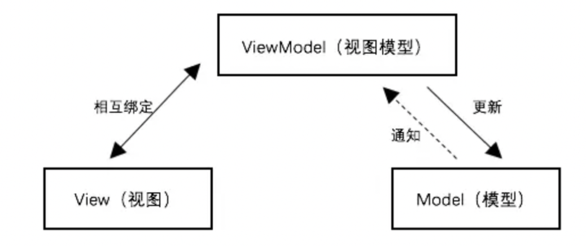
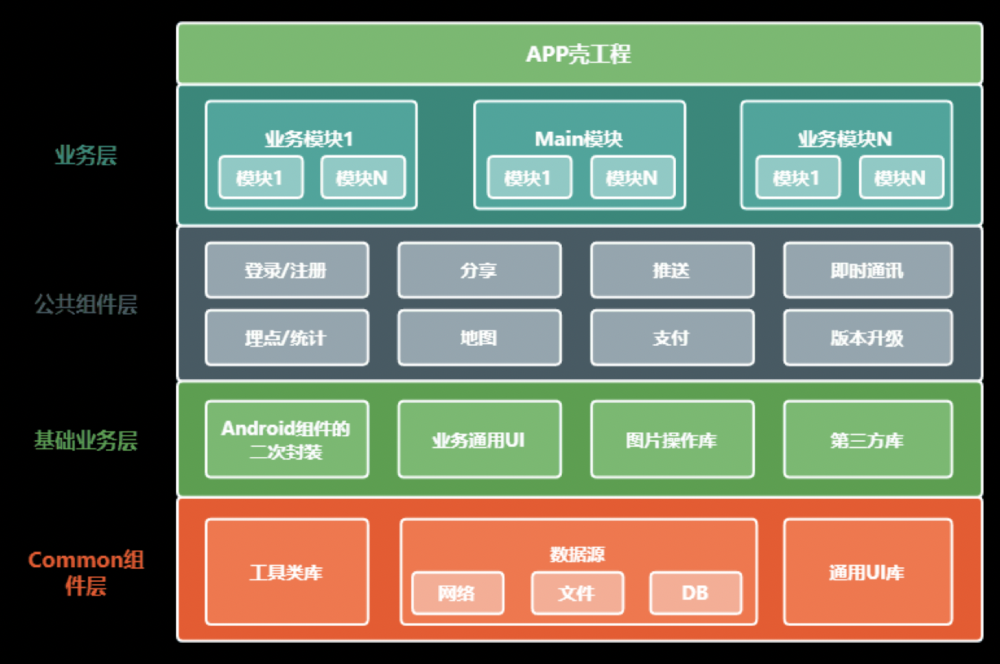

# <a id="设计模式">设计模式</a>

## 三大特征

封装

​	类

继承

​	方法重写、成员变量继承

多态

​	方法重载

## 熟悉六大 OOD 设计原则

> [快速理解-设计模式六大原则](https://www.jianshu.com/p/807bc228dbc2)

### 单一责任原则

- What?

  ​	一个类只干一个事情，抽取出责任相同的模块

- 作用

  ​	可以降低模块之间的耦合性

- 实现

  ​	比如一个图片下载框架，实际上是可以抽象出下载模块(断点续传)，图片缓存(本地、内存LRU)

- 参考

  ​	[面向对象的六大原则之 —— 单一原则](https://blog.csdn.net/asd2603934/article/details/50770147)

### 开闭原则

- What?

  ​	对于扩展开放、修改封闭

- 作用？ 

  对于老的代码采用扩展，这样的话不需要影响到老代码

- 实现

  ​	通过抽象(接口、抽象类)，实现子类来扩展功能，而不是修改原方法。比如一个图片下载框架的缓存，现在有了内存缓存的功能，还需要添加本地缓存的功能，我们不能直接在框架里面修改缓存的功能，而是把缓存抽象出来，实现一个本地缓存的功能模块。

- 参考

  ​	[面向对象的六大原则之 —— 开闭原则](https://blog.csdn.net/asd2603934/article/details/50770976)

### 里式替换原则

- what?

  ​	父类出现的地方，子类都能替换，而子类出现的地方，父类不一定能替换。

- 作用?

  ​	描述继承关系是否合理

- 实现

  ​	接口、抽象类

### 依赖倒置原则

- what?

  ​	高层模块不依赖低层模块，抽象不依赖细节，细节依赖抽象

- 作用

  ​	大中型项目中可以减少需求变化引起的工作量。使并行开发更友好。

- 实现

  ​	通过抽象（接口或抽象类）使个各类或模块的实现彼此独立，互不影响，实现模块间的松耦合

### 接口隔离原则

- what?

  ​	类间的依赖关系应该建立在最小的接口上，也就是说，我们要为各个类建立专用的接口，而不要试图去建立一个很庞大的接口供所有依赖它的类去调用。

- 作用

  ​	提供内聚，接口最小的方式，暴露它对外的能力。

- 实现

  ​	建立单一接口，不要建立庞大臃肿的接口，尽量细化接口，接口中的方法尽量少。

### 迪米特原则

- what?

  ​	最少知识原则，意思就是一个对象应该对其他对象有最少的了解，其实就是解耦合，两个类之间的关系分离的越细越好

- 作用

  ​	类关系之间解耦，修改A类的逻辑的时候，不会动到B类

- 实现

  ​	通过抽象A、B类的能力，A依赖注入的方式引用类B。比如通过给图片下载框架设置图片缓存，就可以让下载框架具有图片缓存的功能，图片下载框架不需要关心图片缓存的具体实现，图片缓存逻辑的修改，不需要改动到图片下载框架。

### 总结

1. 面向接口编程
2. 类和接口的功能尽量单一
3. 当需求改变时，我们应该通过扩展来实现新的需求，而不应去修改底层代码
4. 降低类和类之间的耦合度（也就是关联性）。尽量把类的属性封装起来，只提供方法给外部。

## 熟悉常见的设计模式，可以熟练的运用在项目中

1. 控制反转 IOC、依赖注入 DI

   ​	butterknife，编译时会生成View的注射器(Injector)，运行时完成注入。

   

2. 代理模式

   ​	AIDL中的Proxy是客户端的BinderProxy的代理，Stub是服务端的binder对象。 

   动态代理

   ​	Retrofit 接口 解析注解生成请求对象 

   

3. 单例模式

   - what? 全局就一个对象

   - 使用场景

     ActivityManager.getService() 获取ServiceManager binder池里面的AMS的binder的代理

     double check+volitale的单例模式

     

4. 责任链模式

   - What?

     ​	责任链式传递，如果被处理了，就不继续传递了

   - 使用场景

     ​	`View.requestLayout()` ` View.dispatchTouchEvent `OkHttp的拦截器

     

5. 工厂模式

   - what?

     ​	像是从工厂取货物一样，不关心货物的构建过程。

   - 比如

     ​	`Executors.newFixThreadPool`，Executors 隐藏具体的构建过程，像工厂一样出商品，不需要关注商品的构建过程。

     ​	BitmapFactory中获取Bitmap，比如从流里面获取，从本地获取等

   

6. 适配器模式

   ​	ListView中的adapter，ListView不需要关心数据从哪里来，只关心需要展示几项(GetCount())、有几种样式(getItemType())， 每一项的视图(getView())

   

7. 观察者模式

   - what？

     被观察者的变化，通知观察者

   - sample

     ​	ListView在Adapter中注册通知回调，数据变了之后，Adapter通知ListView刷新，数据是被观察者，ListView是观察者

     ​	Rxjava中，事件流中被观察者的`onNext()`、`onError()`、`onComplete`变化，通知观察者

     

8. 建造者模式

   - what? 

     强调构建过程，可以选择性构建，比如有一个菜，可以选择用哪些食材和调料构建。

   - 适用场景 

     ​	alertDialog由很多参数构建而成，如果用构造函数处理的话，需要写很多个构造方法，然而用构建者模式的话，只需要把用到的构建进去就行。OkHttp参数配置

   

## 理解 MVC、MVP、MVVM 的思想以及区别

### MVC

和MVP的区别:

​	MVC的Model和V是可以访问的，而MVP中M和V不能直接访问，是被隔离开的。在Android中Activity既是V又是C。	

### MVP

​	Activity是V(提供视图操作)，逻辑处理是M，M和V通过P隔离，P使用M去拉取数据，然后P再使用V的去更新视图，通过MVP框架，把视图和逻辑分开，减少Activity的代码量。

### MVVM

> [**MVVM架构篇之DataBinding(-)**](https://juejin.im/post/5beef45be51d450cb4185319)
>
> [**Android官方架构组件DataBinding双向绑定篇: 观察者模式的殊途同归**](https://juejin.im/post/5c3e04b7f265da611b589574)

- what?

  通过ViewModel实现，Model与View的双向绑定，视图树的变化会修改数据，数据的变化会去刷新视图树，从而实现视图的刷新。

- 怎么实现？

  通过DataBinding框架，使用ViewModel实现Model和View的双向绑定。

- 优点

  ​	不需要手动去维护View和数据的状态，只需要定义他们的绑定关系。

- 缺点

  

- 适用场景

  

  ​	

## 项目架构设计与重构

## 项目组件化设计与开发

