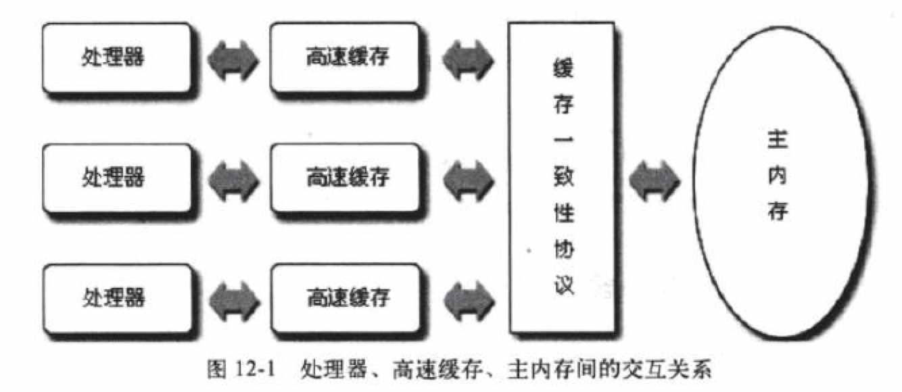
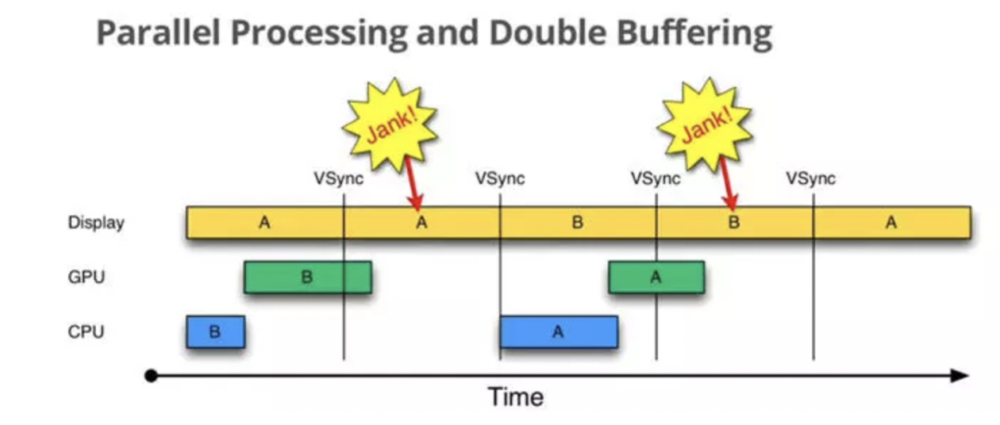
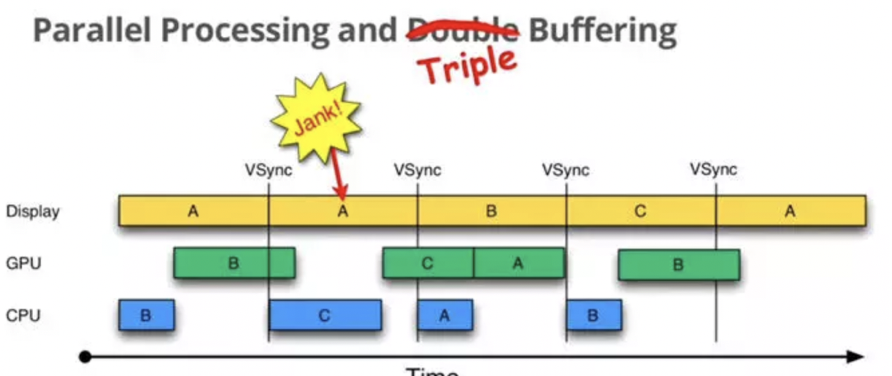
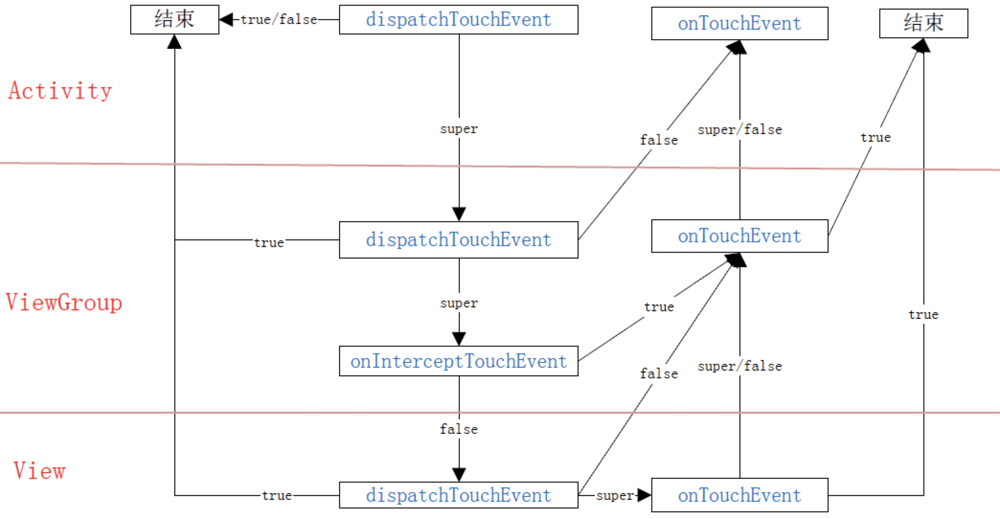
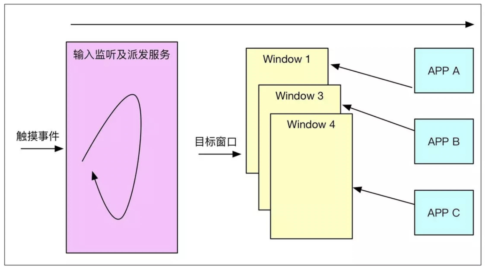

目录

---

**Java基础**

-  [JVM内存模型](#内存模型)
-  [注解](#1.注解)
    -  [`getAnnotation` 过程](#getAnnotation的流程)
-  [内部类](#内部类)
-  [final](#final)
-  [动态代理](#动态代理)
-  [枚举](#枚举)
-  [范型](#范型)
-  [容器](#容器)
    -  迭代器
-  [异常](#异常)

**其他**

- [final、finally、finalize()分别表示什么含义](#final、finally、finalize)

---

**Java并发编程**

-  [线程](#线程)
  + [Thread类(sleep、join、yield、interrupt)](#Thread类)
  + [Object类(wait、notify、notifyAll)](#Object类)
  + [线程的生命周期(新建、就绪，阻塞(等待)、运行、终止](#线程生命周期)
-  [ThreadLocal](#ThreadLocal)
-  [Synchronized](#Synchronized)
-  [ReentrantLock](#ReentrantLock)
-  [volatile](#volatile)
-  [cas](#cas)
-  [线程池](#线程池)

---

**Android**

- Handler
- Binder
- App启动过程
- View绘制过程
- TouchEvent事件分发
- ListView、RecyclerView
- 滚动机制(Scroll、Fling)
- 动画机制(Drawable Animation、View Animation、Property Animation)

- 性能调优
  - [布局优化](#布局优化)
  - 启动优化
  - 绘制优化

---

**开源框架**

- EventBus优化

---

**其他**

- [kotlin](#kotlin)
- [上传库到Maven](#上传到Maven)

---

**计算机网络**

---

**操作系统**

- [死锁](#死锁)

---
**算法**


# Java基础

---

## <a id="内存模型">0. JVM内存模型</a>

| Java堆：存对象，gc最重要的区域 分为年轻代、年老代和永久代 | （Program Counter）程序计数器  一小块内存区域 记录字节码执行 的位置  比如线程切换回来的时候，找到执行入口  特点:无OOM |
| --------------------------------------------------------- | ------------------------------------------------------------ |
|                                                           | 虚拟机栈：方法 栈帧  **局部变量**  **入参**，异常Outofmemory和stackoverflow |
| 方法区：静态常量、class类描述、常量池                     | 本地方栈：native方法                                         |
| **线程共享**                                              | **线程私有**                                                 |

- **GC背景**: `System.gc()` 建议jvm gc，在gc之前会调用对象的 `finalized()`

- gc算法分类
  - 1.程序计数器，引用+1，销毁、失效-1 
  - 2.可达性分析 
    
    -  ## GRoot 静态对象、常量池对象
- 分代回收
  - **新生代**： 一个eden区，两个存活区。Eden满后，把存活的对象复制到存活区。存活区满后，把仍存活的对象复制到另一个存活区，这个也满了后，仍存活的复制到另一个存活区。**一次只有一个存活区**
    - young gc：停止复制算法stop-the-world 
       
  - **年老代** ：young gc几次（默认8次，可调参）后仍存活的复制到年老代、大对象存年老代
    - full gc：标记整理算法，即标记出存活的对象，清除没有引用的对象，并压缩
    - 特殊：如果**年老代对年轻代**对象存在引用，young gc时查询年老代确定是否可清理。查询方式，查 `card table` 表。年老代维护了一个512byte 的card table，存储的是年老代堆年轻代对象的引用。
- 垃圾收集器
  - 并行和串行收集器
  - CMS 收集器 “最短回收停顿优先”收集器（标记—清除算法：初始标记—并发标记—重新标记—并发清除）

## <a id="1.注解">1.注解</a>

- 背景

注解的引入主要是为了和代码紧耦合的添加注释信息，java中常见的注解有@Override、@Deprecated，用Override修饰的方法，在编译的时候会去检查是否是父类存在这个方法，然后编译器提示。

- 使用

注解我们使用的时候是这样声明的，其中上面的 `@Retention` 和 `@Target` 是元注解。 `@Retention` 主要是用于修饰注解的的运行时机，是在运行时还是编译时。`@Target` 用于修饰注解修饰的域，是类还是成员变量还是方法。

```java
@Retention 修饰运行时机  编译 运行时
@Target 修饰类型 比如方法 类 成员变量
@interface Path{
	String value() defalut "";
}
```
然后使用的时候我们是这样的，用注解去注释方法，然后通过**Method**的`getAnnotation` 方法获取注解，然后通过 `value()` 方法获取 `value` 属性。
```java
@Path("/aaa")
void a();

(Path(getMethod("a").getAnnotation(Path.class))) .value();
```
可以看到实际上注解是一个接口，`Method`有一个成员变量map<<? extends Annotation>, Annotations> ，我们通过Method的getAnnotation方法获取注解，再通过value()方法获取我们注解的时候设置的value属性值。因为Method、Construcator、Class等其实都是集成自 `AnnotatedElement` 这个接口，里面有 `getAnnotation` 方法，所以他们都可以获取注解。

- 原理


他们之所以能获取注解，实际上编译器会在编译时会把注解信息写入class里面 `Method` 的属性表，然后我们调用 `getAnnotation` 去获取注解，首先是判断本地有没有 `annotations` 这个成员变量。没有的话，实际上是生成继承至这个注解接口的动态代理对象，然后这里面会实例化一个 `annotationInvocationHandler` 对象，通过注解解析器去解析字节码里面的属性表，维护到这个 `annotationInvocationHandler`里面的 Map<key, value>。然后调用  `value` 方法的时候，判断Method 的名字 `value` 交给 `invocationHandler`，然后去 `InvocationHandler` 里面去取数据。

[JAVA 注解的基本原理](https://juejin.im/post/5b45bd715188251b3a1db54f)

### <a id="getAnnotation的流程">getAnnotation的流程</a>

> `getAnnotation()` 发现没有缓存的 `Annotation` 对象， 通过`AnnotationParser` 解析属性表里面的注解信息到一个map，然后生成 `AnnotationInvocationHandler`，并且生成一个动态代理的Proxy类，然后把代理方法派发给`Handler`，`Handler` 通过方法名比如`value`从Map里面获取属性表参数.


### 简单说：

1.首先注解是一个 `@interface` 声明的，编译的时候，编译器会把注解信息写入 `class` 类信息的属性表里面

2.当我们 `getAnnotation()` 的时候，`annotationParser` 会从属性表解析出 `Map<K,V>`，然后存放到`AnnotationInvocationHandler` 的 `map` 里面，然后会生成一个 继承自 `Proxy` 的 `Proxy$0` 子类，  然后比如把 `value` 方法拦截给 `AnnotationInvocationHandler`，再从 `AnnotationInvocationHandler` 里面查询K 为 `value` 的V. 


## <a id="内部类">2. 内部类</a>
**why?**

​	内部类的引入主要是为了解决Java没有多重继承然后提供的语法糖。

**特点：**

​	内部类定义在另外一个类里面的类。它隐藏在外部类中，封装性更强，**不允许除外部类外的其他类访问它**；

**分类**

​	根据内部类定义的位置，可以分为几类。

-  **成员内部类**
  	能够访问外围类的所有变量和方法，包括私有变量，同时还能集成其他的类。外围类也能访问它的私有变量和方法。编译器会给他们生成access方法。而非静态内部类需要通过生成外部类来间接生成。
-  **静态内部类**
      能够访问外围类的静态变量和静态方法，包括私有属性的。静态内部类是指被声明为static的内部类，可不依赖外部类实例化；
-  **局部内部类**
        访问方法的变量需要使用 `final` 修饰，因为参数在方法调用完之后就出栈了，那么内部类就不能访问到这个变量了。用final申明变量，如果是基础类型，会直接变成值，如果是引用类型，会通过构造函数传进来。
-  **匿名内部类**
        不能用权限修饰符修饰，局部内部类和匿名内部类都默认持有外部类的引用。一般android中，我们为了防止 `Activity` 内存泄露，都是把匿名内部类声明成静态内部类，然后传递Activity的 WeakReference。

[java提高篇(十)-----详解匿名内部类https://www.cnblogs.com/chenssy/p/3390871.html](https://www.cnblogs.com/chenssy/p/3390871.html)
[java提高篇(八)----详解内部类](https://www.cnblogs.com/chenssy/p/3388487.html)


## <a id="final">3. final</a>
- 修饰类 类不能被继承，比如String就是final类型的，内部是字符串的封装操作，系统不希望它被重写。
- 修饰方法 方法不能被子类重写。
       比如View的measure、layout、draw，因为它们内部有缓存逻辑，比如measure会通过计算父布局传过来的MeasureSpec和缓存的meaSpec做比较，然后来控制onMeasure的调用。这个会MeasureSpec是父布局通过父View的measureSpec和子View的LayoutParams 生成的measureSpec，最终传给子View的onMeasure方法。MeasureSpec是32位的整型。前2位是模式，后30位是size。模式分为 `Unspesfic`、`At_most`、`Exctly`，我们自定义View需要处理 `at_most` 模式，比如`TextView` 的 `at_most` 模式就是按照字体的大小和个数来计算出来的。
        比如View的layout方法，主要也是做一些缓存的功能，会去看布局是否变化，如果变化了才去调用 `onLayout` 布局。其中的l、t、r、b参数，最开始是由 `ViewRootImpl` 的 `performLayout` 里面调用 `DecorView` 的 `layout` 方法，传递的参数是子布局在父布局里面的位置，这里是 `DecorView` 在 `PhoneWindow` 里面的位置。
        比如View的 `draw` 方法，实际上了系统固定的绘制流程，比如先绘制background，实际是调用`backgroundDrawable` 的 `draw()` 方法，比如说颜色，ColorDrawable。然后调用 `onDraw()` 在绘制内容区域，然后调用 `dispatchDraw` 去绘制子布局，这个方法是 `ViewGroup` 实现的。之后画滚动条啥的。这里说一下，这个canvas 其实是 `Surface` 对象 lockCanvas 得来的，绘制完成后，封装成 `FrameBuffer` 然后发送给 `SurfaceFlinger` 进程绘制。
- 修饰变量（说明final变量引用指向的对象地址不能变）
  - 成员变量 
    	只能被初始化一次。
  - 局部变量
         主要是局部内部类或者是匿名内部类使用，因为方法在调用完成之后会出栈，然后形参和局部变量就失效，因为变量需要给匿名内部类使用，所以声明成 `final` ，让它指向的地址不能变。如果 `final` 变量是基础类型，编译的时候就确定，直接替换成基础的确认的值，如果是引用，会把引用通过构造函数传进来。
```java
public Destionation destionation(final String str) {
        /**
         * 在局部变量中声明为final就好了，这个原因是由于method方法调用完毕之后就从栈中弹出了，
         * 但是这个时候由于局部内部类中使用了这个方法中的局部变量，而这个类还是不会立即回收的，
         * 所以只能将局部变量声明为final，表示常量。
         */
        final int num = 1; //局部内部类引用类，所以要声明为final

        class PDestionation implements Destionation { //不能加访问修饰符
            private String label;

            private PDestionation(String whereTo) {
                label = whereTo;
                outterNoStaticMethod(); //可以访问外部类的方法
            }

            public String readLabel() {
                System.out.println(numOutter);//可以直接访问外部类私有变量 生成access$100方法
                System.out.println(numOutterStatic);//可以直接访问外部类私有静态变量
                return label + num + str; //引用函数的变量，会通过构造函数传进来
            }

            @Override
            public void destionate() {

            }
        }
        return new PDestionation(str);
    }
```
```java
 class Parcel5$1PDestionation implements Destionation {
    private String label;
//局部变量构造函数传入
    Parcel5$1PDestionation(Parcel5 this$0, String whereTo, String var3) {
        this.this$0 = this$0;
        this.val$str = var3;
        this.label = whereTo;
        Parcel5.access$000(this$0);
    }
	
    public String readLabel() {
        System.out.println(Parcel5.access$100(this.this$0)); //外部私有非静态变量
        System.out.println(Parcel5.access$200()); //外部私有静态变量
        return this.label + 1 + this.val$str;
    }

    public void destionate() {
    }
}
```

- 扩展

  防止重排序 cpu总线 内存屏障

  [jvm内存模型 重排序 内存屏障](https://www.cnblogs.com/flystar32/p/6684593.html)


## <a id="动态代理">4.动态代理</a>
- **好处：**

  ​	静态代理灵活，不需要每次一个方法都实现一遍。还有一个注意的地方就是，相当于把接口的方法全部拦截给 `InvocationHandler` 了，`Retrofit` 使用这个特性，把 `RPC` 的接口，拦截掉然后生成 `Request` 请求对象。

- **使用：** 

  ​	通过 `Proxy.newProxyInstance(classLoader，Class<?>[] interfaces, invocationHandler)` 生成代理对象

- **原理：**

  ​	自己组装了一个继承自`Proxy`类实现 `inters` 接口的名字叫 `Proxy$0`的类，`Proxy` 类有一个`InvocationHandler` 成员，通过构造函数传入。所有实现的方法通过 `invoke` 方法把 `this`，`method`，`params`转发出去，然后调用一个 `native` 方法把这个字节流交给 `classLoader` 完成类加载。(具体例子参考  [LoveStudy](https://github.com/samwangzhibo/LoveStudy) 项目 `com.example.wangzhibo.lovestudy.jvm.dproxy`)
```java
//动态代理类 代理类继承了IBossImpl 接口
public final class $Proxy0 extends Proxy implements IBossImpl {
    private static Method m1;
    private static Method m3;
    private static Method m2;
    private static Method m4;
    private static Method m0;
 
    public $Proxy0(InvocationHandler var1) throws  {
        super(var1);
    }
 
    public final boolean equals(Object var1) throws  {
        try {
            return ((Boolean)super.h.invoke(this, m1, new Object[]{var1})).booleanValue();
        } catch (RuntimeException | Error var3) {
            throw var3;
        } catch (Throwable var4) {
            throw new UndeclaredThrowableException(var4);
        }
    }
    
    //实现buy方法
    public final String buy(Object var1) throws  {
        try {
            return (String)super.h.invoke(this, m3, new Object[]{var1});
        } catch (RuntimeException | Error var3) {
            throw var3;
        } catch (Throwable var4) {
            throw new UndeclaredThrowableException(var4);
        }
    }
 
    public final String toString() throws  {
        try {
            return (String)super.h.invoke(this, m2, (Object[])null);
        } catch (RuntimeException | Error var2) {
            throw var2;
        } catch (Throwable var3) {
            throw new UndeclaredThrowableException(var3);
        }
    }
 
    //实现发邮件方法 
    public final String email(Object var1) throws  {
        try {
            return (String)super.h.invoke(this, m4, new Object[]{var1});
        } catch (RuntimeException | Error var3) {
            throw var3;
        } catch (Throwable var4) {
            throw new UndeclaredThrowableException(var4);
        }
    }
 
    public final int hashCode() throws  {
        try {
            return ((Integer)super.h.invoke(this, m0, (Object[])null)).intValue();
        } catch (RuntimeException | Error var2) {
            throw var2;
        } catch (Throwable var3) {
            throw new UndeclaredThrowableException(var3);
        }
    }
 
    static {
        try {
            m1 = Class.forName("java.lang.Object").getMethod("equals", new Class[]{Class.forName("java.lang.Object")});
            m3 = Class.forName("com.example.wangzhibo.lovestudy.jvm.dproxy.IBossImpl").getMethod("buy", new Class[]{Class.forName("java.lang.Object")});
            m2 = Class.forName("java.lang.Object").getMethod("toString", new Class[0]);
            m4 = Class.forName("com.example.wangzhibo.lovestudy.jvm.dproxy.IBossImpl").getMethod("email", new Class[]{Class.forName("java.lang.Object")});
            m0 = Class.forName("java.lang.Object").getMethod("hashCode", new Class[0]);
        } catch (NoSuchMethodException var2) {
            throw new NoSuchMethodError(var2.getMessage());
        } catch (ClassNotFoundException var3) {
            throw new NoClassDefFoundError(var3.getMessage());
        }
    }
}
```


## <a id="范型">5.范型</a>

- **背景**：如果没有范型，比如 `Object[] a = new String[100];`，你修改a的时候，比如放入`1`，取出来使用的时候，可能会抛出 `ClassCastException`

- **范型使用**

  - `class Stack<T> ` 修饰类
  - `<T> T poll(T element) ` 修饰方法

- **注意点**

  - 不可变  `List<Object> a = new ArrayList<String>()`报错，因为如果能赋值的话，`new ArrayList<Integer>()` 也能放，所以就会又出现 `classCastException`

- **特点**

  - 非限定通配符 ? 表示任意类型 `void a(List<?> list)`
  - 上下界
    -  `super` 是某个类的父类 比如 `void a(List<? super Integer> list)`  
    -  `extends` 某个类的子类 比如 `void a(List<? extends Number> list)` 

- **原理**：范型擦除  最终都是`Object` 类

- **问题**

  - **范型本质是 `object`，如果调用方法呢？**

    `class Util<T extends Number>`，那么`T` 就是 `Number` 的子类，可以调用 `Number` 的方法。

  - **什么是通配符？**

    范型是不可变的，也就是说如果一个 `ArrayList<Integer>` 赋值给 `ArrayList<Object>` 是不行的，如果我们用 `ArrayList<?>` 表示可以接受任意参数的 `ArrayList`。

[Java泛型常见面试题](https://blog.csdn.net/qq_25827845/article/details/76735277)


## <a id="容器">6.容器</a>

`ArrayList`

- 数据结构

  - 数组

- 扩容

  - **扩容时机**，存放的时候，大小已经达到最大(和HashMap不同，HashMap有一个相关因子0.75，当元素个数到 `size * 0.75`时，双倍扩容 )，扩容方式，**1.5倍**

- 原理

  - `System.arraycopy()` 拷贝高效

  - [`memmove` ](<https://www.cnblogs.com/xiehy/archive/2010/10/29/1864532.html>)

    `extern void *memmove(void *dest, const void *src, unsigned int count);`

    功能：由src所指内存区域复制count个字节到dest所指内存区域。

    说明：src和dest所指内存区域可以重叠，但复制后dest内容会被更改。函数返回指向dest的指针。

- 优化 初始化时指定默认大小


`HashMap`

 - **数据结构**

    -  数组+链表 默认大小16，上限2^31，扩容因子0.75，容量加倍
       - 优化：如果知道使用的个数，能够指定一个值，以免不必要的扩容
       - Entry里面有K、V、next

- **put操作**：对象的 `hashcode`除以length取余，这个优化是与数组 `(length-1)` 做按位 `&`，然后冲突之后就使用**头插法(1.7)** 把当前节点插到头部(可能是为了Lru的考虑)

- **扩容** 16的倍数扩容 相关因子0.75 

- **线程不安全：**

  - **数据脏写** 同时读 同时写 如果同时写到链表头 有一个修改就丢弃了

  - `resize` **扩容死循环**

    - 原因：`resize` `transfer`

      

    - 解决：[老生常谈，HashMap的死循环](<https://juejin.im/post/5a66a08d5188253dc3321da0#heading-1>)
  - **Fast fail 策略**，迭代的时候，做了操作， 修改了modCount的值

    - 解决：使用`CopyOnWriteArrayList`

- **1.8版本特性**：

    - **查询性能**：转树，当冲突个数达到8个，链表转变成红黑树(二叉平衡树)，查找时间复杂度O(lgn)
    - **死循环解决**，尾插法

- **线程安全的Map**


`ConcurrentHashMap`

- 修改了迭代器没有使用modCount

- 1.7版本
  - 使用的16个 `Segment`，每个 `Segment`是一个`ReentrantLock`重入锁，锁一块的时候，不会影响其他块，提高写性能
- 1.8版本 
  - **CAS操作**：initTable  transfer(扩容)等操作使用  `CAS`无锁机制(缺点cpu 100%)
  - 直接锁冲突头结点的元素
- **读操作没有锁**  [怎么保证读到的不是脏数据?](<https://juejin.im/entry/5b98b89bf265da0abd35034c>)  `volatile` 保证**可见性**、**有序性**


### Iterator

- 出现背景：因为有迭代器，容器的遍历可以不考虑其存储结构，用迭代器的统一接口完成遍历.
- 注意点：迭代的时候能够删除节点，但是不能新增节点，否则会抛出 `ConcurrentModifyException` 
- 使用

```java
  Iterator iterator = list.iterator();
  while(iterator.hasNext()) {
    int i = (int) iterator.next();
    System.out.println(i + "");
  }
```

- 实现原理：

```java
  protected int limit = ArrayList.this.size;
        int cursor;       // 表示下一个要访问的元素的索引，从next()方法的具体实现就可看出
        int lastRet = -1; // 表示上一个访问的元素的索引; -1 if no such
        int expectedModCount = modCount; //表示对ArrayList修改次数的期望值，它的初始值为modCount。
        public boolean hasNext() {
                    //如果没超出limit
                    return cursor < limit;
        }

        public E next() {
            if (modCount != expectedModCount)
                throw new ConcurrentModificationException();
            int i = cursor;
            if (i >= limit)
                throw new NoSuchElementException();
            Object[] elementData = ArrayList.this.elementData;
            if (i >= elementData.length)
                throw new ConcurrentModificationException();
            cursor = i + 1;
            return (E) elementData[lastRet = i];
        }

        public void remove() {
            if (lastRet < 0)
                throw new IllegalStateException();
            if (modCount != expectedModCount)
                throw new ConcurrentModificationException();

            try {
                ArrayList.this.remove(lastRet);
                cursor = lastRet;
                lastRet = -1;
                expectedModCount = modCount;
                limit--;
            } catch (IndexOutOfBoundsException ex) {
                throw new ConcurrentModificationException();
            }
        }
```

- ConcurrentModifyException：(调用list.remove()方法导致 `modCount` 和 `expectedModCount` 的值不一致。) [Java ConcurrentModificationException异常原因和解决方法](https://www.cnblogs.com/dolphin0520/p/3933551.html)
  - 单线程环境 ：`remove()` 可以使用 直接操作 `list` 的话 会导致 `modCount` 和 `expectedModCount`不一致
  - 多线程环境 `remove()`不能使用，因为不同线程遍历的时候生成了不同的 `Iterator`，也就是 `expectModCount` 是私有的，但是 `modCount` 是共有的，一个线程把 `modCount++` 了，另一个线程的 `expectModCount` 并不知道
  - 如何解决 1.在使用iterator迭代的时候使用synchronized或者Lock进行同步； 2.使用并发容器CopyOnWriteArrayList代替ArrayList和Vector。

### CopyOnWriteArrayList

[先简单说一说Java中的CopyOnWriteArrayList](https://juejin.im/post/5aaa2ba8f265da239530b69e)

- **背景：**concurrentModifyException(在迭代的时候添加了数据，导致容器内部的 `modCount` 和 迭代内部的 `expectCount` 不一致，抛出异常)，写时拷贝策略(add操作的时候，先复制一个新的数组，然后修改新的数组，完成之后再赋值回原数组)
- **how?** 

写时拷贝策略，add操作的时候，先复制一个新的数组，然后修改新的数组，完成之后再赋值回原数组，这样就不会修改modCount字段了，而是直接把修改完的结果，覆盖原`object[]`


## <a id="枚举">7.枚举</a>

通过 `enum` 关键字声明，实际上会生成一个继承 `Enum` 类的子类，他是final的，其中通过 静态块完成 `static final` 成员变量的初始化操作，其中 `values()` 方法返回枚举数组，`valueOf(String name)` 方法通过遍历数组，通过名字查找枚举。枚举里面能够申明 `abstract` 方法，然后每个枚举对象就会重写这个方法，实际上编译器会给枚举添加 `abstract` 申明，然后每个枚举的常量其实是一个匿名类内部类。

```java
enum Week{
	Monday, Tuesday
}
```

```java
/**
 * 一个enum除了不能继承自一个enum之外(编译器不让)，我们基本上可以将enum看作一个常规的类。也就是说我们可以向enum中添加方法。
 *
 * 生成的CustomEnum自动继承自Enum<CustomEnum>，所以我们不能再继承Enum了，单继承。
 * Created by samwangzhibo on 2019/3/21.
 */

public enum CustomEnum {
    Normal("平常", 1) {
        @Override
        String getInfo() {
            return "平常信息";
        }
    }, High("高", 2) {
        @Override
        String getInfo() {
            return "高信息";
        }
    }, Low("低", 3) {
        @Override
        String getInfo() {
            return "低信息";
        }
    };

    private String description;
    private int value;

    CustomEnum(String description, int value) {
        this.description = description;
        this.value = value;
    }

    public String getDescription() {
        return description;
    }

    public int getValue() {
        return value;
    }

    /**
     * 抽象方法，类没有生命成abstract 编译器会自动生成abstract
     * Normal High Low 会自动申明匿名内部类
     * @return
     */
    abstract String getInfo();

}
```

[深入理解Java枚举类型(enum)](https://blog.csdn.net/javazejian/article/details/71333103)


## <a id="异常">8.异常</a>

- 分类
  - Error
    - 错误，不能通过代码修复的，可以不用处理 
    - 例子：`StackOverFlowError` `OutOfMemoryError`
  - Exception
    - 执行异常（RuntimeException）
      - 特点：可能在执行方法期间抛出但未被捕获的`RuntimeException`的任何子类都**无需在`throws`**子句中进行声明
      - 举例：`Java.lang.IndexOutOfBoundsException` `Java.lang.ClassCastException`  `Java.lang.NullPointerException` `ConcurrentModifyException`
    - 检查异常（Checked Exceptions）
      - 特点：一个方法**必须通过throws**语句在方法的声明部分说明它可能抛出但并未捕获的所有checkedException
      - 举例：`Java.lang.ClassNotFoundException` `Java.lang.NoSuchMethodException` `InterruptedException` `Java.lang.NoSuchFieldException`


## **9. Java其他**

### <a id="final、finally、finalize()">9.1 final、finally、finalize()分别表示什么含义</a>

> - 技术点：final、finally、finalize()
> - 参考回答：
>
> - final关键字表示不可更改，具体体现在：
>   - final修饰的变量必须要初始化，且赋初值后不能再重新赋值
>   - final修饰的方法不能被子类重写
>   - final修饰的类不能被继承
> - finally：和try、catch成套使用进行异常处理，无论是否捕获或处理异常，finally块里的语句都会被执行，在以下4种特殊情况下，finally块才不会被执行：
>   - 在finally语句块中发生了异常
>   - 在前面的代码中用了System.exit()退出程序
>   - 程序所在的线程死亡
>   - 关闭CPU
> - finalize()：是Object中的方法，当垃圾回收器将回收对象从内存中清除出去之前会调用finalize()，但此时并不代表该回收对象一定会“死亡”，还有机会“逃脱”


---

#**Java并发编程**

## 1. Q：什么是线程安全？保障线程安全有哪些手段？`

> 技术点：线程安全
>
> 思路：详见[要点提炼| 理解JVM之线程安全&锁优化](https://www.jianshu.com/p/ca8801044352) 
>
> 参考回答：线程安全就是当多个线程访问一个对象时，如果不用考虑这些线程在运行时环境下的调度和交替执行，也不需要进行额外的同步，或者在调用方进行任何其他的协调操作，调用这个对象的行为都可以获得正确的结果，那这个对象是线程安全的。保证线程安全可从多线程三特性出发： 
>
> - 原子性
>
> （Atomicity）：单个或多个操作是要么全部执行，要么都不执行 
>
> - Lock：保证同时只有一个线程能拿到锁，并执行申请锁和释放锁的代码
>
> - synchronized：对线程加独占锁，被它修饰的类/方法/变量只允许一个线程访问
> - 可见性
>
> （Visibility）：当一个线程修改了共享变量的值，其他线程能够立即得知这个修改 
>
> - volatile：保证新值能**立即**同步到主内存，且每次使用前立即从主内存刷新；
> - synchronized：在释放锁之前会将工作内存新值更新到主存中
> - 有序性
>
> （Ordering）：程序代码按照指令顺序执行 
>
> - volatile： 本身就包含了禁止指令重排序的语义
> - synchronized：保证一个变量在同一个时刻只允许一条线程对其进行lock操作，使得持有同一个锁的两个同步块只能串行地进入
> [java多线程系列(五)---synchronized ReentrantLock volatile Atomic 原理分析](http://www.cnblogs.com/-new/p/7326820.html)


## <a id="线程">2. 线程</a>

### <a id="Thread">Thread类(sleep、join、yield、interrupt)</a>
- sleep：暂停当前正在执行的线程；不释放锁（有限等待、native方法）

- yield：释放当前线程CPU时间片，让他回到就绪状态，并执行其他线程；（native方法）

- join：暂停调用线程，等该线程终止之后再执行当前线程；(有限等待、用的wait实现)

  > - join如何阻塞调用的当前线程？
  >
  > 获取线程的`lock`锁，调用`wait()`，等线程执行完之后 JVM调用该线程的lock对象的`notify()`

```java
Thread thread1 = new Thread();
Thread thread2 = new Thread(){
    void run(){
        thread1.join(); 
    }
};
```


- interrupt：中断该线程，当线程调用wait(),sleep(),join()或I/O操作时，将收到InterruptedException或 ClosedByInterruptException；(native)

  >  如果线程正在运行，interrupt方法只会设置标志位，如果线程阻塞状态，将会抛出`interruptedException`
  >
  >  **注意**：如果线程在`wait`状态，并且不能获取锁，`Interrupt` 没有反应

### <a id="Object类">Object类(wait、notify、notifyAll)</a>

锁池：存放竞争锁的线程
等待池：等待线程，当被唤醒的时候，会进入锁池(wait-set)

- wait：暂停当前正在执行的线程，直到调用notify()或notifyAll()方法或超时，退出等待状态；(需要先获得锁)

  > **重点**: 调用`wait()`，立马释放锁，线程拥塞

  > - 限时等待时，锁被占了，还能恢复吗？
  >
  > 不能，限时等待的前提是线程要能获得锁，这一点和 `interrupt` 方法很像，如果当前线程`wait`，并且不能获取锁，那么不能抛出 `interrupt` 异常
- notify：唤醒在该对象上等待的一个线程；(需要先获得锁 synchronized) 
>**注意**：notify只会随机唤醒一个线程，如果其他线程没有被notify，会导致线程饥饿
>
>notify只是唤醒其他线程，其他线程的执行需要等到方法执行完之后释放锁才行。
- notifyAll：唤醒在该对象上等待的所有线程；(需要先获得锁)

参考 [Java线程中yield与join方法的区别](http://www.importnew.com/14958.html)

### <a id="线程生命周期">线程生命周期(新建、就绪、阻塞(运行) 、运行、终止)</a>


### 相关问题：

`Wait和Sleep的区别`

- Wait和Sleep都不占用CPU，wait 会释放锁，sleep不释放锁
- wait必须要在`synchronized`块里面使用，wait可以携带等待时间参数(限时等待，但是如果这个时候锁被占用，不能被分配给它，限时等待不能唤醒，原理就是jvm会在一段时间后，分配锁和时间片给它)，也可以不携带等待时间参数(不限时等待，直到其他线程调用 `notify`或者`notifyAll`唤醒他，`notify`的话是随机唤醒，没有处理好，容易造成线程一直处理等待状态，线程饥饿)， sleep的话是必须传入一个时间，阻塞一段时间后，再由操作系统唤醒。


---


## <a id="ThreadLocal">3. ThreadLocal</a>
ThreadLocal类

- 背景：可实现线程本地存储的功能，把共享数据的可见范围限制在同一个线程之内，无须同步就能保证线程之间不出现数据争用的问题，这里可理解为ThreadLocal很方便的找到本线程的Looper。
  使用：ThreadLocal<T>.set(T)  ThreadLocal.get()
- 原理：每个线程的Thread对象中都有一个ThreadLocalMap 对象`ThreadLocalMap(ThreadLocal<?> firstKey, Object firstValue)`，它存储了一组以ThreadLocal.threadLocalHashCode为key、以本地线程变量为value的键值对，而ThreadLocal对象就是当前线程的ThreadLocalMap的访问入口，也就包含了一个独一无二的threadLocalHashCode值，通过这个值就可以在线程键值值对中找回对应的本地线程变量。
  需要注意的点就是ThreadLocal的Entry使用的是弱引用，是因为ThreadLocal变量会被线程一直持有，容易造成内存泄露 ，所以使用弱引用。

## <a id="Synchronized">4. synchronized</a>

- **背景** 多线程安全的三个特性，原子性（保证线程执行完才能执行其他线程）、可见性（`synchronized执行完之前把工作内存的值写回主存`）、有序性

- **使用**

  - 修饰方法
    - 静态方法，获取的是方法区 `class` 类文件的锁，所以**不影响非静态同步方法**
    - 非静态方法，获取的是 `this` 的锁
  - 修饰对象  获取的是对象的`monitor` 监控器

- **特点**  重入锁、悲观锁、独占锁、重量级锁

- **原理**

  如果是`class`类锁，静态方法或者class对象代码块，其实是在字节码的flag字段里面加入 `ACC_SYNCHRONIZED`

  `synchronized` 关键字同步的实现依赖于字节码，会在 `synchronized` 同步块的前后适用 `monitorenter` 和 `monitorexit` 指令，`monitorenter` 操作会去获取对象的锁(每个对象头部有一个监控器monitor 对象的头文件)，如果这个对象没被锁或者当前线程已经获得了锁(**重入锁**)，那么monitor的**计数器+1**，如果已经被其他线程锁住了，**自旋**等待一会最后阻塞，知道其他线程释放锁。执行 `monitorexit` 指令，**计数器-1**，直到计数器为0，释放锁。但是监视器锁本质又是依赖于底层的操作系统的**Mutex Lock**来实现的。

- **适用场景和缺点**

  悲观锁，**多写**的环境，多读的环境用乐观锁。**CPU切换**上下文**内核态和用户态**切换开销，**线程阻塞和唤醒**开销。

- 版本优化

  - 1.6之后， **偏向锁** 和 **轻量级锁** 。synchronized的底层实现主要依靠 **Lock-Free** 的队列，基本思路是 **自旋后阻塞**，**竞争切换后继续竞争锁**，**稍微牺牲了公平性，但获得了高吞吐量**。在线程冲突较少的情况下，可以获得和CAS类似的性能；而线程冲突严重的情况下，性能远高于CAS。

- 参考 [java多线程系列(五)---synchronized ReentrantLock volatile Atomic 原理分析](http://www.cnblogs.com/-new/p/7326820.html)

## 5. 扩展

### 1. [非公平锁与公平锁](<https://www.jianshu.com/p/f584799f1c77>)

- 线程饥饿 
  - 背景
    - **高优先级线程**占用大多数CPU时间片，低优先级线程饥饿
    - 线程被永远阻塞在等待同步块的状态(synchronized同步块一直不释放锁)
    - `notify` 和 `synchronized`  **不保证线程唤醒的顺序**
  - 解决 **Lock公平锁**
  - 参考 [线程饥饿](<https://cloud.tencent.com/developer/article/1193092>)

### 2. 无锁状态、偏向锁、轻量级锁、重量级锁

- 偏向锁

  - 背景：为了在无多线程竞争的情况下尽量**减少不必要的轻量级锁执行路径**

- 轻量级锁

  通过`CAS`操作修改Mark Word锁标志位，如果成功，说明执行代码操作，如果竞争失败，则膨胀为重量级锁，阻塞线程。

- 重量级锁

  - 适用**Mutex Lock**，用户态到内核态的切换

| 锁       | 优点                                                         | 缺点                                             | 适用场景                             |
| -------- | ------------------------------------------------------------ | ------------------------------------------------ | ------------------------------------ |
| 偏向锁   | 加锁和解锁不需要额外的消耗，和执行非同步方法比仅存在纳秒级的差距。 | 如果线程间存在锁竞争，会带来额外的锁撤销的消耗。 | 适用于只有一个线程访问同步块场景。   |
| 轻量级锁 | 竞争的线程不会阻塞，提高了程序的响应速度。                   | 如果始终得不到锁竞争的线程使用自旋会消耗CPU。    | 追求响应时间。同步块执行速度非常快。 |
| 重量级锁 | 线程竞争不使用自旋，不会消耗CPU。                            | 线程阻塞，响应时间缓慢。                         | 追求吞吐量。同步块执行速度较长。     |

- 优化

  - **适应性自旋（Adaptive Spinning）** 

    ​	线程如果自旋成功了，那么下次自旋的次数会更加多，因为虚拟机认为既然上次成功了，那么此次自旋也很有可能会再次成功，那么它就会允许自旋等待持续的次数更多。反之，如果对于某个锁，很少有自旋能够成功的，那么在以后要或者这个锁的时候自旋的次数会减少甚至省略掉自旋过程，以免浪费处理器资源

  - **锁粗化（Lock Coarsening）** 编译器优化，比如 `StringBuffer` 拼接的时候，扩大锁的范围

  - **锁消除（Lock Elimination）** 编译器优化，如果某个操作只可能被一个线程适用，那么消除锁

- 缺点：

  优化在锁竞争很激烈的情况反而降低了效率，可以通过 `-XX:-UseBiasedLocking` 来禁用偏向锁 

- 参考 [Java并发编程：Synchronized底层优化（偏向锁、轻量级锁）](https://www.cnblogs.com/paddix/p/5405678.html) [**死磕 Java 并发 - 深入分析 synchronized 的实现原理**](https://juejin.im/entry/589981fc1b69e60059a2156a) [java锁偏向锁](<https://ccqy66.github.io/2018/03/07/java%E9%94%81%E5%81%8F%E5%90%91%E9%94%81/>)  [Java面试必问-死锁终极篇](<https://juejin.im/post/5aaf6ee76fb9a028d3753534>)


## 6. JIT(HotSpot 虚拟机)

- 背景：加速热点代码的运行

- 原理 

  Java程序最初是通过解释器进行解释执行的，当虚拟机发现**某个方法或代码块**运行的**特别频繁**时，就会把这些代码认定为**“热点代码”（Hot Spot Code）**。为了提高热点代码的执行效率，在运行时，虚拟机将会把这些代码编译成为**本地平台相关的机器码**，并进行优化，而完成这个任务的编译器称为及时编译器（Just In Time Compiler，简称JIT）。

---

## 7. Lock

### <a id="ReentrantLock">ReentrantLock</a>

- 背景：`synchronized` 的缺点是 **等待不可中断**、**非公平模式**(可能线程饥饿)、一个 `synchronized` 内部只能使用一个对象 `wait` 

- 优点

  - 等待可中断
  - 公平模式
  - 一个 `ReentrantLock` 创建多个 `condition`，每个 `condition` 有 `await(等待)` 和 `signal(唤醒)`

- 使用

  - 等待可中断 `lockInterruptibly()`  限时等待 `tryLock()` 解决死锁
  - 公平模式 `new ReentrantLock(true)`
  - 多个condition

  ```java
  ReentrantLock lock = new ReentrantLock();
  Condition notEmpty = lock.newCondition();
  public static void main(String[] args) throws InterruptedException {
          lock.lock();
          new Thread(new SignalThread()).start();
          System.out.println("主线程等待通知");
          try {
              condition.await();
          } finally {
              lock.unlock();
          }
          System.out.println("主线程恢复运行");
      }
      static class SignalThread implements Runnable {
  
          @Override
          public void run() {
              lock.lock();
              try {
                  condition.signal();
                  System.out.println("子线程通知");
              } finally {
                  lock.unlock();
              }
          }
      }
  ```

  ```java
  //reentrantLock实现阻塞队列
  public class MyBlockingQueue<E> {
  
      int size;//阻塞队列最大容量
  
      ReentrantLock lock = new ReentrantLock();
  
      LinkedList<E> list=new LinkedList<>();//队列底层实现
  
      Condition notFull = lock.newCondition();//队列满时的等待条件
      Condition notEmpty = lock.newCondition();//队列空时的等待条件
  
      public MyBlockingQueue(int size) {
          this.size = size;
      }
  
      public void enqueue(E e) throws InterruptedException {
          lock.lock();
          try {
              while (list.size() ==size)//队列已满,在notFull条件上等待
                  notFull.await();
              list.add(e);//入队:加入链表末尾
              System.out.println("入队：" +e);
              notEmpty.signal(); //通知在notEmpty条件上等待的线程
          } finally {
              lock.unlock();
          }
      }
  
      public E dequeue() throws InterruptedException {
          E e;
          lock.lock();
          try {
              while (list.size() == 0)//队列为空,在notEmpty条件上等待
                  notEmpty.await();
              e = list.removeFirst();//出队:移除链表首元素
              System.out.println("出队："+e);
              notFull.signal();//通知在notFull条件上等待的线程
              return e;
          } finally {
              lock.unlock();
          }
      }
  }
  ```

  

- 和 `synchronized` 比较

  | 名称          | 相同点                                   | 不同点                                               |
  | ------------- | ---------------------------------------- | ---------------------------------------------------- |
  | ReentrantLock | 独占锁,只允许线程互斥的访问临界区 可重入 | 1.手动加锁和解锁 2.公平锁 3.等待中断 4.多个condition |
  | Synchronized  |                                          | synchronized加锁解锁的过程是隐式的                   |

- 原理 [从源码角度彻底理解ReentrantLock(重入锁)](https://www.cnblogs.com/takumicx/p/9402021.html)

  AbstractQueuedSynchronizer

  - 进入队列 `CAS`

  - 阻塞 `LockSupport` 

    ```java
    private final boolean parkAndCheckInterrupt() {
        LockSupport.park(this);
        return Thread.interrupted();
    }
    ```

  - 唤醒

    ```java
     LockSupport.unpark(s.thread);
    ```

- 扩展

- 参考 [ReentrantLock(重入锁)功能详解和应用演示](https://www.cnblogs.com/takumicx/p/9338983.html) [阻塞和唤醒线程——LockSupport功能简介及原理浅析](https://www.cnblogs.com/takumicx/p/9328459.html)

### ReadWriteLock

### LockSupport

- Why? `wait`、`notify` 的缺点，1.wait和notify使用的时候只能在同步块 2.`notify` 只能唤醒随机的线程，无法唤醒指定线程

- 使用

  ```java
  public class LockSupportTest {
  
      public static void main(String[] args) {
          Thread parkThread = new Thread(new ParkThread());
          parkThread.start();
          System.out.println("开始线程唤醒");
          LockSupport.unpark(parkThread);
          System.out.println("结束线程唤醒");
  
      }
  
      static class ParkThread implements Runnable{
  
          @Override
          public void run() {
              System.out.println("开始线程阻塞");
              LockSupport.park();
              System.out.println("结束线程阻塞");
          }
      }
  }
  ```

- 原理
- 特点
- 缺点


## <a id="volatile">8. volatile</a>

(背景) `volatile` 的引入保证了线程并发的可见性。

>  **为什么需要处理器缓存?**
>
> ​	相对于CPU的执行顺序，主寸的读取数据慢，所以引入寄存器缓存和高速缓存
>
> **缓存带来的问题**
>
> ​	缓存一致性问题，不同线程的缓存变量

 (使用)被 `volatile` 修饰的变量，线程每次修改之后，都把结果写回主内存，而不是 cpu缓存，然后通知其他线程缓存无效，需要从主内存读取，而不是用cpu缓存，这保证了内存一致性，还有就是 `volatile` 可以**禁止指令重排序**，重排序是编译器为了优化指令而不影响执行结果做的操作。

(例子) `volatile` 经常在单例的 `double check` 中使用。

(原理) `volatile` 会让编译的汇编代码加上 `lock`前缀，`lock` 之后的写操作，会让其他CPU的相关缓存失效，从而重新从主内存加载最新数据。



## <a id="cas">9. CAS (compare and swap)</a>

- 背景

乐观锁，比 `synchronized` 更轻量级，`synchronized` 涉及到内核状态的线程切换，cas则是通过自旋请求，缺点是CPU占用率高

- 特点：**乐观锁**

- 使用

  cas中有3个参数，A是变量的地址(A的值)，B是变量的期待值，C是要设置的值

- 举例

  比如有个变量i=0，A、B 2个线程都做`i++` 操作，这其实涉及到3个操作，`read` `load``use` `assign` `write``store`等原子操作[java并发内存模型以及内存操作规则](<https://blog.csdn.net/l1394049664/article/details/81475380>)，A、B同时读出值为0，然后A修改后值为1，B修改之后还是1，A同步会主内存之后i的值为1，然后B `cas` 操作，第二个参数为0，第三个参数为1，由于第二个参数预期的值0和内存的值1不一样，所以 `cas` 设置是失败，自旋重试，然后就设置上了.

- 原理

  由于compareAndSwap是`Unsafe`包里面的，这个操作CPU保证的原子指令

- 使用场景 **多读的应用类型，这样可以提高吞吐量**

- 缺点：

  - ####  [ABA问题](<https://juejin.im/post/5b4977ae5188251b146b2fc8>)  

    - `AtomicStampedReference` 检查当前引用是否等于预期引用，并且当前标志是否等于预期标志

  - 只能保证一个共享变量的原子操作 

    - 多个对象封装到 `AtomicReference类`

  - CPU占比很高、吞吐量很高

- 参考 [面试必备之乐观锁与悲观锁](<https://juejin.im/post/5b4977ae5188251b146b2fc8>) [面试难点：你了解乐观锁和悲观锁吗？](https://mp.weixin.qq.com/s/OsQYHZfLYKqY6QtReO4qww)


## <a id="线程池">10. 线程池</a>

- 背景：线程池主要是为了解决**频繁创建线程的CPU和资源开销**，还可以**控制最大的线程数量**，核心的线程数量，回收线程，队列化的处理，还有拒绝策略
- 使用：核心线程数，最大线程数，回收时间、拥塞队列、线程工厂、拒绝Handler

```java
public ThreadPoolExecutor(int corePoolSize,
                              int maximumPoolSize,
                              long keepAliveTime,
                              TimeUnit unit,
                              BlockingQueue<Runnable> workQueue,
                              ThreadFactory threadFactory,
                              RejectedExecutionHandler handler)
```

- 例子

**FixThreadPool：**定长线程池，全是**核心**线程，快速处理

```java
 public static ExecutorService newFixedThreadPool(int nThreads) {
        return new ThreadPoolExecutor(nThreads, nThreads,0L, TimeUnit.MILLISECONDS,
                                      new LinkedBlockingQueue<Runnable>());
    }
```

使用的 `LinkedBlockingQueue`，默认是 `Integer.Max`的队列长度，`LinkedBlockingQueue` 的底层实现用的`ReentarintLock` 和 `Condition`，这是一个**生产者消费者**问题，当队列满的时候，阻塞生产者的 `put`操作(用的condition的await())，唤醒消费者去 `take`(用的condition的`signal`)， 当队列空的时候，阻塞消费者的 `take`， 通知生产者 `put`。

**SingleThreadPool：**只有**一个核心**线程，请求同步执行，适合同步非耗时请求

```java
new ThreadPoolExecutor(1, 1, 0L, TimeUnit.MILLISECONDS,
                                    new LinkedBlockingQueue<Runnable>())
```

**CacheThreadPool：**缓存线程池，没有核心线程，都是**非核心**线程，适合处理高频非耗时请求

```java
new ThreadPoolExecutor(0, Integer.MAX_VALUE, 60L, TimeUnit.SECONDS,
                                      new SynchronousQueue<Runnable>());
```


> **特殊**：队列使用的是 `SynchronousQueue`，这个队列的特点是大小为0，**取操作之后才能放**
>
> 为什么使用这个队列？因为 `ThreadPoolExecutor`的策略，先是判断核心线程，这个队列核心线程数为0，则判断队列，队列也为0 ，所以就创建非核心线程，然后非核心线程就需要超时回收。

**ScheduledThreadPool**：核心线程数量**固定**，非核心线程数量**不定**；可进行**定时**任务和**固定**周期的任务。

```java
 super(corePoolSize, Integer.MAX_VALUE,
              DEFAULT_KEEPALIVE_MILLIS, MILLISECONDS,
              new DelayedWorkQueue());
```

> ```java
> scheduledThreadPool.schedule(runnable, 1, TimeUnit.SECONDS); //1s之后执行
> //1s之后执行，每隔1s执行一次
> scheduledThreadPool.scheduleAtFixedRate(runnable, 1, 1, TimeUnit.SECONDS);
> ```
>
> 实现：使用 **[DelayWorkQueue](<https://www.jianshu.com/p/587901245c95>)**，保证添加到队列中的任务，会按照任务的延时时间进行排序，延时时间少的任务首先被获取。

- 策略
  - **当前线程数量小于核心线程数**，直接创建线程。 `addWorker()`
  - **当前线程数量等于核心**，放入`BlockingQueue`，等线程`take`出来执行
  - **`BlockingQueue`满了** , 就创建非核心线程执行任务(`addWorker()`)，然后用限时等待的 `poll(6000)`取消息，如果消息为 `null` 就回收线程，当线程等于核心线程时就不回收了。
  - **非核心线程数大于最大线程数**，执行拒绝策略(或者shutdown)。

- 原理

  - 数据结构 ArrayList<Worker> workers BlockingQueue queue

  - 线程如何共享任务的？

    每个线程死循环从 `BlockingQueue` 取消息，然后执行 `Runnable`

  - 非核心线程如何进行回收？

- 参考

  [Java ThreadPoolExecutor线程池学习笔记(使用、原理、常见问题总结)-这一篇就够了](https://blog.csdn.net/wangzhibo666/article/details/88305797)

  

额外

`execute和submit的区别？`

- 参数不同

  - `void execute(Runnable command)` 提交的是 `Runnable`。

  - ` <T> Future<T> submit(Callable<T> task)`  提交一个实现了Callable接口的对象，而Callable接口中是一个有返回值的call方法，当主线程调用**Future的 `get` **方法的时候会获取到从线程中返回的**结果**数据，如果在线程的执行过程中发生了异常，get会获取到**异常**的信息。

  - ```java
    public <T> Future<T> submit(Callable<T> task) {
        if (task == null) throw new NullPointerException();
        RunnableFuture<T> ftask = newTaskFor(task);
        execute(ftask);
        return ftask;
    }
    
    public interface Callable<V> {
        /**
         * Computes a result, or throws an exception if unable to do so.
         *
         * @return computed result
         * @throws Exception if unable to compute a result
         */
        V call() throws Exception;
    }
    ```

- 描述

`execute` 和  `submit` 的参数不同，`execute` 的参数是 `Runnable`， 没有返回值，而`submit` 的参数是 `Callback`，其中有个 `call` 方法可以返回值，然后 `submit` 返回一个`Future` 对象，`Future`对象的`get` 方法可以获取值还能捕获异常

---

# Android

## 0. Android概论


[Android开发工程师面试指南](https://github.com/sucese/android-interview-guide)

## 0.1 系统启动过程

### init 进程

>  了解 init 进程创建与启动的流程。

- 简介
- 创建和启动过程

### Zygote 进程

> 了解 Zygote 进程创建的流程，以及 fork 的过程。

### system_server 进程

>  了解 system_server 进程启动流程，工作流程。

### ServiceManager

> 了解 ServiceManager 的启动流程，以及 ServiceManager 在系统中的作用。

- 简介

  管理ams、pms、wms等binder

- 作用

  其他进程要和系统的服务通信，从它这里获取服务和binder的映射关系

- 启动流程


## 1. Handler

1. Handler通过 `sendMessage()` 发送Message到MessageQueue队列；

2. Looper通过 `loop()` ，不断提取出达到触发条件的Message，并将Message交给target来处理；

3. 经过dispatchMessage()后，交回给Handler的handleMessage()来进行相应地处理。

   **ps** : 

   > 将Message加入MessageQueue时，处往管道写入字符，可以会唤醒loop线程；
   >
   > 如果MessageQueue中没有Message，并处于Idle状态，则会执行 IdelHandler 接口中的方法，往往用于做一些清理性地工作。


### Looper

```java
//1.初始化Looper对象到线程本地变量
private static void prepare(boolean quitAllowed) {
  if (sThreadLocal.get() != null) {
    throw new RuntimeException("Only one Looper may be created per thread");
  }
  sThreadLocal.set(new Looper(quitAllowed));
}

//2.循环，取出一条消息然后分发给Handler
void loop(){
  for(;){
    Message msg = next(); //may blocking 
    if(msg == null){ //退出
      break;
    }
  }
} ;

//3. 退出loop()循环，往队列里面写入一个null消息，获取出空消息时，退出循环
public void quit() {
    mQueue.quit(false);
}

```

### MessageQueue

```java
// 1.获取消息 
Message next(){}

// 2.移出所有消息，放入一条null消息，然后唤醒阻塞线程
 void quit(boolean safe) {
  removeAllMessagesLocked();
  // We can assume mPtr != 0 because mQuitting was previously false.
  nativeWake(mPtr);
}
}
```


### epoll

```c++
void Looper::rebuildEpollLocked() {
    if (mEpollFd >= 0) {
        close(mEpollFd); //关闭旧的epoll实例
    }
    mEpollFd = epoll_create(EPOLL_SIZE_HINT); //创建新的epoll实例，并注册wake管道
    struct epoll_event eventItem;
    memset(& eventItem, 0, sizeof(epoll_event)); //把未使用的数据区域进行置0操作
    eventItem.events = EPOLLIN; //可读事件
    eventItem.data.fd = mWakeEventFd;
    //将唤醒事件(mWakeEventFd)添加到epoll实例(mEpollFd)
    int result = epoll_ctl(mEpollFd, EPOLL_CTL_ADD, mWakeEventFd, & eventItem);

    for (size_t i = 0; i < mRequests.size(); i++) {
        const Request& request = mRequests.valueAt(i);
        struct epoll_event eventItem;
        request.initEventItem(&eventItem);
        //将request队列的事件，分别添加到epoll实例
        int epollResult = epoll_ctl(mEpollFd, EPOLL_CTL_ADD, request.fd, & eventItem);
    }
}

//创建新的epoll实例，并注册wake管道
mEpollFd = epoll_create(EPOLL_SIZE_HINT);

//将唤醒事件(mWakeEventFd)添加到epoll实例(mEpollFd)
int result = epoll_ctl(mEpollFd, EPOLL_CTL_ADD, mWakeEventFd, & eventItem);

//等待事件发生或者超时，在nativeWake()方法，向管道写端写入字符，则该方法会返回；
int eventCount = epoll_wait(mEpollFd, eventItems, EPOLL_MAX_EVENTS, timeoutMillis);

```

参考

[Android消息机制2-Handler(Native层)](<http://gityuan.com/2015/12/27/handler-message-native/>)

## 2. Binder

- **Why?** 

  - **高效**，只拷贝一次，socket那些都需要拷贝2次，从用户空间到内核空间，再从内核空间到用户空间。`binder` 适用 `mmap` 系统调用，把用户空间和内核空间都映射到同一块物理页，4M，然后只需要拷贝到 这个地址，用户空间就完成了内容传递。
  - **安全**，协议里面带有uid验证

- **use?**

  

- **Sample (aidl)**

  - Impl 接口
  - Stub 这个一个 `Binder`，继承impl接口，是服务端用的，有`onTransact`方法
  - Proxy，是`BinderProxy`的代理，继承impl接口，有`Transact` 方法。

- **跨进程观察者**

  - Why? 

    服务端主动通知客户端，比如有个下载服务，多进程复用下载服务，提交一个地址下载文件，并且会返回**下载百分比**。如果没有观察者，我们需要主动去轮训百分比结果，有观察者的话，服务端可以主动通知客户端。

  - how？

    1.首先需要定义一个接口，因为binder传递的对象只能是序列化的，所以接口的定义也是用aidl

    2.把这个aidl接口调用服务端`register`方法注册的 `Proxy` 对象，这里注册的是 `Stub`对象，实际上服务端持有的是 `Stub.asInterface()`之后的代理对象，我们在这个 `Stub` 使用数据，比如进度的百分比，然后我们就使用 `ProgressBar` 来展示。

    3.然后客户端调用下载方法，服务器线程池开启线程下载，然后调用客户端的回调通知客户端，这里这个回调就是 `Proxy`，相当于是客户端的binder客户端。

  - **key point**

    这里因为客户端持有的是binder的服务端，所以回调其实是在 **binder线程池** 调用的，所以回调需要抛到主线程处理。

- **原理**

  

- **缺点** 因为映射的物理页大小设置问题，通常是1Mb限制


## 2.1 其他IPC

### Socket

​	Socket 是系统中常见的一种 IPC 通信方式，Socket 的应用范围很广，在进程间通信、网络通信都会用到，建议深入了解下。

### Pipe

​	Pipe（管道）是 Linux 系统中常见的一种 IPC 通信方式，建议深入了解下工作原理。

### signal

​	signal（信号量）是系统中常见的一种 IPC 通信方式，建议深入了解下工作原理。


## 3. App启动流程

- 主流程
  1. **Pause上一个Activity**，比如Launcher
  2. AMS**开启一个进程**(`Process.start()`)，`Looper.loop()`，`ActivityThread.attach(new applicationThread())`，并且启动ActivityThread(只是一个类，不是线程)中的主线程
  3. ActivityThread和**AMS连接**，传入`applicationThread` 的匿名binder
  4. **创建Application**，`AMS#attachApplication()`, 新建`Application`， 新建 application级别的context( `ContextImpl#createAppContext()`)，回调 `onCreate()`
  5. **启动Activity**，`applicationThread#scheduleLaunchActivity()`，`H` Handler 转发，主线程`performLaunchActivity()`,  新建`Activity`，并且 attach activity级别的Context(`ContextImpl#createActivityContext()`)，生成Window(`new PhoneWindow()`)，然后回调 `onCreate()`，生成 DecorView(`installDecor()`)，`setContextView(R.layout.xml)`(通过 LayoutInflator 解析xml至视图树到DecorView)
  6. **执行绘制**，`handleResumeActivity()`，先执行 `onStart`， 然后执行 `onResume`，之后获取`windowManager` 并执行 `windowManager#addView()`，最后调用`WindowGlobabl#addView()`，创建ViewRootImpl，调用 `requestLayout()` 方法，`performTraversal()`， 调用 `performMeasure()`、 `performLayout()`、`performDraw()`
  7. **建立事件通道**，创建 `WindowInputEventReceiver`，使用`pair` 创建2个`channel`，事件的服务是InputManagerService，进程是SystemServer，线程是`InputReader`和`InputDispatcher`，事件处理模块EventHub。这里为啥是socket，一个binder通信有大小限制，而且调用的时候是阻塞的. 
  8. 通知上个Activity **onStop**


## 4.View绘制机制

### **重要概念**

**ViewRootImpl**

> 绘制的主流程类，什么invalidate()和requestLayout()最后都是让它去执行。
>
> 执行流程：自DecorView(根View)起，找它的ChildView执行(递归)
>
> 比如，onMeasure的时候，先执行DecorView的`onMeasure()`，之后遍历子View的`onMeasure`，直到所有的View都执行了`onMeasure()`


**DecorView**

> 就是一个FrameLayout，与FrameLayout相比，增加了WindowCallback的回调(需要与window交互，有概念就行)


**Window**

> 抽象的概念，PhoneWindow是它的唯一实现类。

Window实际上是View的直接管理者。 

1. 不管是Activity、Dialog还是Toast，它们的视图实际上都是附加在Window上的。
2. View是Android中呈现视图的方式，但是View不能单独存在，必须附着在Window这个抽象的概念上。Android中的所有视图都是通过Window来实现的,有视图的地方就有Window。

- 问题1：为什么有View还需要Window

  View只关注视图的展示，比如视图多大 `onMeasure()`、视图放在哪 `onLayout()`

  视图怎么画 `onDraw()`，而Window(如PhoneWindow)需要关注一些手势事件的接收分发、一些按键的分发、主题啥的

PhoneWindow

> 一种Window，每个Activity attach context的时候才创建的，具体时机看参考资料


**WindowManager**

> 抽象的概念，实现类是**WindowManagerImpl**， 最后又是通过WindowManagerGlobal去处理。
>
> 提供`addView()`、`removeView()`、`updateView()`，实际上最后时候 WindowManagerService(WMS)通过binder的IPC通信


**Activity**

> 1. 系统抽象的组件，由ActivityManagerService(AMS)管理，比如跳转其他Activity，实际上是调用AMS的`startActivity()`方法，
>
> 2. 提供生命周期，onCreate()、onStart() 等，提供Window的事件处理功能回调 dispatchTouchEvent()，不负责View
>
>    的绘制相关功能。


**WindowManagerService**

> 系统的服务，其实就是在system_server系统进程里面的一个对象，和ActivityManagerService(管4大组件启动、生命周期、切换)、PackageManagerService(管解析apk包信息，安装的时候用)称为三大Service


**参考资料**：

[5分钟告诉你，Activity的视图绘制流程(onMeasure、onLayout、onDraw的调用和参数解释)](https://blog.csdn.net/wangzhibo666/article/details/86656675)


**流程图**(看不懂无所谓):


### ViewRootImpl的创建

applicationThread.scheduleLaunchActivity  ->  ActivityThread.LaunchActivity  ->  Activity.attach(创建phoneWindow)  -> Activity.onCreate(setContentView，生成DecorView，解析layout文件并添加到contentView里面，构建视图树) 

->  ActivityThread.perfromResumeActivity -> windownManager.addView(创建viewRootImpl) -> windowGlobal.addView() ->  ViewRootImpl.requestLayout ->  ViewRootImpl.performTraversal

### 测量

#### **执行流程**

ViewRootImpl.performTraversal -> performMeasure(根measureSpec，由window的大小和decorView的layoutParams计算出) -> DecorView(View).measure -> 

FrameLayout.onMeasure  ->   ViewGroup.measurechild(父布局的measpec和子布局的layoutparams计算出来的measureSpec) -> View.measure  -> View.onMeasure()

​	View测量的最开始是由ViewRootImpl的performTraversal开始的，然后执行performMeasure()，调用DecorView的measure方法，DecorView是FrameLayout的子类，之后调用FrameLayout的onMeasure方法，onMeasure由会去找其childView，挨个执行measure()和onMeasure()

#### 参数解释

`onMeasure(widthMeasureSpec, heightMeasureSpec)`

​	widthMeasureSpec和heightMeasureSpec是由父布局的measpec和子布局的layoutparams计算出来的measureSpec

**MeasureSpec**

> 是一个32位的数，前2位是mode(Unspecified、Exactly、AtMost)，后30位是size

mode解释

- Unspecified: 未指定，比如ScrollView不指定View的高度

- Exactly：确定的，比如match_parent，parent是100dp的话，你也是100dp，所以就是确定的

- AtMost：不要超过父布局，比如wrap_content，不知道自己有多大，限制不要超过父布局，这种情况比如TextView的 wrap_content，我们在`onMeasure(widthMeasureSpec, heightMeasureSpec)`中判断是AtMost，我们就使用TextView画笔一个字的高度做高，`字数 * 字宽`作为TextView的宽。

#### 自定义方法

​	这个方法就是要测量宽高，有几种修改宽高的方法

1. 自己合成MeasureSpec再交给方法

   ``` java
     protected void onMeasure(int widthMeasureSpec, int heightMeasureSpec) {
       // 强行把宽度设置成4000px
       measureSpec = MeasureSpec.makeMeasureSpec(4000, MeasureSpec.EXACTLY);
       super.onMeasure(measureSpec, measureSpec);
     }
   ```

2. 自己设置宽高

   ```java
       protected void onMeasure(int widthMeasureSpec, int heightMeasureSpec) {
         super.onMeasure(widthMeasureSpec, heightMeasureSpec);
         // 按照自己的规则计算宽度
         mWidth = getMySize(widthMeasureSpec, mWidth);
         mHeight = getMySize(heightMeasureSpec, mHeight);
         // 实际控制视图宽高的方法
         setMeasuredDimension(mWidth, mHeight);
       }
   ```

#### 调试技巧

​	打日志的话，直接去measureSpec调用`getSize()` 和 `getMode()` 看宽高是否有问题

### 布局

#### 执行流程：

ViewRootImpl.performTraversal -> ViewRootImpl.performLayout() -> DecorView(View).layout(父布局中的left,top,right,bottom) -> 

DecorView.onLayout()子类重写 -> FrameLayout.onLayout() -> getChildAt(i).layout() -> View.layout -> View.onLayout(在frameLayout中的left)


​	View的layout方法，主要也是做一些缓存的功能，会去看布局是否变化，如果变化了才去调用 `onLayout` 布局。其中的l、t、r、b参数，最开始是由 `ViewRootImpl` 的 `performLayout` 里面调用 `DecorView` 的 `layout` 方法，传递的参数是子布局在父布局里面的位置，这里是 `DecorView` 在 `PhoneWindow` 里面的位置

#### 方法参数详解：

**onLayout(isChanged, left, top, right, bottom)**

1. isChanged：这次重新布局该View在父布局中的位置是否变化
2. Left: 该View的左边距离父布局中左边的距离
3. Top: 该View的顶部距离父布局顶部的距离
4. Right: 该View的右边距离父布局的左侧距离
5. Bottom:该View的底部距离父布局的距离


**相关方法**

getLeft()

``` java
    /**
     * Left position of this view relative to its parent.
     * view的左边相对于父布局左边的距离
     * @return The left edge of this view, in pixels.
     */
    @ViewDebug.CapturedViewProperty
    public final int getLeft() {
        return mLeft;
    }
```

getTop()

``` java
		/**
     * Top position of this view relative to its parent.
     * view顶部距离父布局顶部的距离
     * @return The top of this view, in pixels.
     */
    @ViewDebug.CapturedViewProperty
    public final int getTop() {
        return mTop;
    }
```

getRight()

``` java
    /**
     * Right position of this view relative to its parent.
     * view的右边距离父布局左边的距离
     * @return The right edge of this view, in pixels.
     */
    @ViewDebug.CapturedViewProperty
    public final int getRight() {
        return mRight;
    }
```

View的宽度 = getRight() - getLeft() 

> 不是绝对的，如果View的宽度大于父布局宽度

View的高度 = getBottom() - getTop()

> 不是绝对的，如果View的高度大于父布局高度


### 绘制

#### 执行流程:

ViewRootImpl.performTraversal -> viewRootImpl.performDraw() -> viewRootImpl.draw() -> viewRootImpl.drawSoftWare() -> DecorView.draw(canvas来至surface.unlockCanvas(dirty)) -> View.draw() 

-> View.drawBackground(canvas)  backgroundDrawable.draw(canvas)


#### 绘制方法

onDraw(Canvas canvas)

> canvas是由surface

​	比如View的 `draw` 方法，实际上了系统固定的绘制流程，比如先绘制background，实际是调用`backgroundDrawable` 的 `draw()` 方法，比如说颜色，ColorDrawable。然后调用 `onDraw()` 在绘制内容区域，然后调用 `dispatchDraw` 去绘制子布局，这个方法是 `ViewGroup` 实现的。之后画滚动条啥的。这里说一下，这个canvas 其实是 `Surface` 对象 lockCanvas 得来的，绘制完成后，封装成 `FrameBuffer` 然后发送给 `SurfaceFlinger` 进程绘制。


### 相关方法源码

**invalidate()原理**

- 调用链

  ​	 View#`invalidate()` -> View#`invalidateInternal` -> ViewGroup#`invalidateChild()` -> ViewGroup#`invalidateChildInParent` ->  ViewRootImpl#`scheduleTraversals()`

- 总结

  ​	View调用invalidate()重绘，然后调用父View的invalidate()，最后到DecorView的invalidate()，DecorView又调用ViewRootImpl

**requestLayout() 原理**

​	requestLayout()会调用父类的 requestLayout() 并且重置Layout的Flag，父类的requestLayout()又调用它父类的requestLayout()，这是一个责任链模式，最终调用DecorView的requestLayout()，DecorView的parent其实是ViewRootImpl， ViewRootImpl类requestLayout()—scheduleTraversals()—doTraversal()—performTraversals()，然后刚刚重置了标志位，所以不会走缓存。


## 4.1 显示系统

> 这章主要是讲解framework层面，为啥canvas draw()了之后，就能显示到屏幕上了，包括60s渲染一次是谁控制的，OpenGl是怎么调用的，扩展讲一下CPU GPU双缓冲机制，这一块和SurfaceView和紧耦合

SurfaceFlinger FrameBuffer Surface  

framework层 EventThread(接收VSync事件通知)  HWComposer(处理部分SurfaceFlinger委托过来的合成工作) EGL(OpenGL是一个操作GPU的API CPU到GPU)  display


#### GPU和CPU的执行流程

CPU: measure -> layout -> draw -> skin -> Resterization

GPU: measure -> layout -> draw(之前都是在CPU中) -> GPU(OpenGL ES) -> Resterization


#### Android中的16ms

> 系统每隔16ms就绘制一帧，这次的时候就缓冲下次的帧

**GPU CPU Display双缓冲技术** VSYNC**信号**





参考

[**关于Android中16ms的问题**](https://www.jianshu.com/p/02800806356c)

[Android丢帧分析与优化](https://www.jianshu.com/p/989ce9eb7af8)

[深入Android渲染机制](http://www.cnblogs.com/ldq2016/p/6668148.html)


## 5. TouchEvent事件传递机制





[Input系统—UI线程](http://gityuan.com/2016/12/24/input-ui/)

[**十分钟了解Android触摸事件原理（InputManagerService）**](https://juejin.im/post/5a291aca51882531926e9e3d)


Activity.makeVisible() -> WindowManagerImpl.addView() -> WindowManagerGlobal.addView()

ViewRootImp#WindowInputEventRecevier ->  ViewRootImpl$ViewPostImeInputStage.dispatchTouchEvent -> DecorView.dispatchTouchEvent

Activity.dispatchTouchEvent ->  PhoneWindow.superDispatch -> DecorView.superDispatchTouchEvent  -> FrameLayout -> ViewGroup


-> dispatchTouchEvent(1.true，直接退出分发事件  2.false  自己不分发 把事件交给下个view或者父view  3.super 自己分发事件)

-> onInterceptTouchEvent(1.true 拦截事件 之后就不再调用  2. false  不拦截 继续分发   3.super 调用父类拦截 比如recyclerView)

-> onTouch先执行 返回true 就不执行onTouchEvent onTouchEvent(1.false 不消耗   2.true 消耗掉  不继续下发  3.super调用父类的)

- 1.action_cancle 被父view拦截时或者手势操作被打断 比如弹框 一般当做action_up处理
- 2.action_down时候onTouchEvent或者onTouch返回true 才能继续下发事件
- 3.子布局被拦截之后，可以通过getParent.requestDisallowIntercept设置 disallowIntercept FLAG，递归过程一直向上设置FLAG标志
- 4.同一级的View  后面写的位于前面的上面一层，FrameLayout倒序遍历的，在事件分发时候，先分发给上面一层，上面一层如果dispatchTouchEvent返回true的话，就不分发给下面一层了

### InputManagerService

[十分钟了解Android触摸事件原理（InputManagerService）](https://juejin.im/post/5a291aca51882531926e9e3d)


## 6. 滚动机制(Scroll、Fling)

View#`scrollTo(int x, int y)`

> x往左是正方向  y往上是正方向  和坐标系相反

原理

​	canvas画布的移动

Scroller

> 滚动的辅助类

- 使用

  见[类](https://github.com/samwangzhibo/LoveStudy/blob/master/app/src/main/java/com/example/wangzhibo/lovestudy/touchevent/DispatchLinearLayout.java)

  ``` java
  /**
   * scroller的使用
   *  1.重写{@link View#computeScroll()} 其中使用 {@link Scroller#computeScrollOffset()}判断是否结束滑动，调用ScrollTo(dx,dy)
   *  2.startScroll 开始滑动 调用invalidate方法
   *
   *  scrollBy(0, 100)的原理
   *  调用ScrollTo() 正数的话 视图往Y轴上移动  可以理解为当前窗口的移动 而不是背景的移动
   *
   * Created by samwangzhibo on 2019/1/25.
   */
  
  public class DispatchLinearLayout extends LinearLayout {
      private static final String TAG = "DispatchLinearLayout";
      Scroller scroller;
      public DispatchLinearLayout(Context context) {
          this(context, null);
      }
  
      public DispatchLinearLayout(Context context, AttributeSet attrs) {
          super(context, attrs);
          scroller = new Scroller(context);
      }
  
      @Override
      public void computeScroll() {
        // 滑动没有结束 其实就是当前时间/总时间获取到当前的值
         if (scroller.computeScrollOffset()){
           // 手动调用scrollTo
             scrollTo(scroller.getCurrX(), scroller.getCurrY());
             postInvalidate();
         }
  
      private void startScroll() {
          scroller.startScroll(300, 300, -300, -300, 3000);
          invalidate();
      }
  
  }
  ```

- 原理

  ​	调用`startScroll()` 然后开始刷新，会走View的`computeScroll()`，然后调用 `computeScrollOffset()`，根据当前的时间 / 总时间 获取到的时间百分比，计算出当前的scrollX、scrollY，然后调用 `scrollTo(x, y)` 实际的实现滚动，然后继续调用 invalidate() 重新走computeScroll()

  ​	

- 小结

  1. scrollTo()、scrollBy()中的x,y是和屏幕坐标系的正方向相反，最终通过移动canvas实现
  2. scroller是实现平滑滚动的封装类，提供了平滑计算的startScroll()，还有快抛的fling()方法(原理一样的，只是数学计算公式不一样，给人惯性的感觉)。

  

## 7. 动画机制(Drawable Animation、View Animation、Property Animation)

- **帧动画** (AnimationDrawable)

  - 使用

    ```java
     AnimationDrawable ad = new AnimationDrawable();//1.创建AnimationDrawable对象
            ColorDrawable redDrawable = new ColorDrawable(Color.RED);
            ColorDrawable yellowDrawable = new ColorDrawable(Color.YELLOW);
            ColorDrawable blueDrawable = new ColorDrawable(Color.BLUE);
            ad.addFrame(redDrawable, 500); //2.添加图片帧和时间
            ad.addFrame(yellowDrawable, 500);
            ad.addFrame(blueDrawable, 500);
    
            ad.setOneShot(false);//3.设置是否执行一次
            handleView.setBackground(ad);//4.将帧动画作为view背景
            ad.start();//5.播放动画
    ```

  - 原理

     	每隔**一定时间**朝主线程的队列抛掷一个 `invalidate` 重刷任务，一定时间是xml配置的时间

- **补间动画** (ViewAnimation)

  - what?  通过Canvas Matrix的变化

  - 分类

    > TranslateAnimation、 RotateAnimation、AlphaAnimation、ScaleAnimation

  - Usage

    - 自定义

      > 重写apply方法，获取其中的Matrix做修改

      ```java
      /**
       * 3D旋转动画  使用{@link Camera}
       * Created by samwangzhibo on 2019/3/22.
       */
      
      public class ThirdDRotationAnim extends Animation{
          private int mCenterWidth, mCenterHeight;
          private Camera mCamera = new Camera();
          private float mRotateY = 0.0f;
      
          // 一般在此方法初始化一些动画相关的变量和值
          @Override
          public void initialize(int width, int height, int parentWidth, int parentHeight) {
              super.initialize(width, height, parentWidth, parentHeight);
              // 设置默认时长
              setDuration(4000);
              // 保持动画的结束状态
              setFillAfter(false);
              // 设置默认插值器
              setInterpolator(new BounceInterpolator());// 回弹效果的插值器
              mCenterWidth = width / 2;
              mCenterHeight = height /2;
          }
      
          // 暴露接口设置旋转角度
          public void setRotateY(float rotateY) {
              mRotateY = rotateY;
          }
      
          // 自定义动画的核心，在动画的执行过程中会不断回调此方法，并且每次回调interpolatedTime值都在不断变化(0----1)
          @Override
          protected void applyTransformation(float interpolatedTime, Transformation t) {
              super.applyTransformation(interpolatedTime, t);
              final Matrix matrix = t.getMatrix();
              mCamera.save();
              // 使用Camera设置Y轴方向的旋转角度
              mCamera.rotateY(mRotateY * interpolatedTime);
              // 将旋转变化作用到matrix上
              mCamera.getMatrix(matrix);
              mCamera.restore();
      
              // 通过pre方法设置矩阵作用前的偏移量来改变旋转中心
              matrix.preTranslate(mCenterWidth, mCenterHeight);// 在旋转之前开始位移动画
              matrix.postTranslate(-mCenterWidth, -mCenterHeight);// 在旋转之后开始位移动画
          }
      
      }
      ```

    - 正常

    ```java
     AnimationSet animationSet = new AnimationSet(false);
            animationSet.setFillAfter(true);
    
            TranslateAnimation translateAnimation = new TranslateAnimation(0, 500, 0, 500);
            translateAnimation.setDuration(3000);
            translateAnimation.setFillAfter(false);
            translateAnimation.setStartTime(System.currentTimeMillis() + 5000);
            animationSet.addAnimation(translateAnimation);
    
    
            RotateAnimation rotateAnimation = new RotateAnimation(0f, 180f,
                    RotateAnimation.RELATIVE_TO_SELF, 0.5f,
            RotateAnimation.RELATIVE_TO_SELF, 0.5f);
            translateAnimation.setFillAfter(false);
            rotateAnimation.setDuration(3000);
            animationSet.addAnimation(rotateAnimation);
    
            handleView.startAnimation(animationSet);
    ```

  - How?

    ​	每个View有一个 `Animation mCurrentAnimation` 对象，`View#startAnimation() ` 开始，重绘整个视图树，`View.draw(canvas)` 里面获取Animation然后初始化，利用消逝的时间和总时间 差值器(`Interploter`)计算出变化百分比，然后计算出属性的值，然后绘制Canvas。

  - 缺点

    ​	动画只改变了Canvas，并没有改变属性的值，所以事件分发响应的位置还是老位置

- 属性动画

  - What? 通过直接改变属性来完成动画

  - 概念

    - Interpolator (差值器)

      ```java
      float getInterpolation(float input) {
              return input;
          }
      ```

    - Evaluator (估值器)

      `Object evaluate(float fraction, Object startValue, Object endValue)`

  - Usage

    ```java
      ObjectAnimator objectAnimator = ObjectAnimator.ofFloat(handleView, "translationX", 0, 300);
            objectAnimator.start();
    ```

  - How? 

    **Choreographer** 和 **VSnc** 垂直同步信号量回调
  
  
  
  |      | 补间动画                             | 属性动画               |
  | ---- | ------------------------------------ | ---------------------- |
  | 性能 | 只是画布的变化，性能好               | 需要反射，需要整体刷新 |
  | 位置 | 只改变画布，不改变属性，点击位置不变 | 改变属性，点击位置改变 |
  |      |                                      |                        |
  
  

### Airbnb 动画库Lottie

- 是什么？

  ​	把AE导成Android、iOS原生动画

- 怎么用？

  ``` java
  LottieAnimationView animationView = (LottieAnimationView) findViewById(R.id.animation_view);
  animationView.setAnimation("hello-world.json");
  animationView.loop(true);
  ```

- 适用场景

  ​	只是播放动画，如果需要根据百分比展示，需要调研下

- 关键模块与类

​	

- 原理
  1. 适配原理
  2. 绘制原理
  3. 动画原理

- 参考

  ​	[Airbnb 动画库Lottie](https://www.jianshu.com/p/19106e3d07b2)

  ​	[Android 之 Lottie 实现炫酷动画背后的原理](https://mp.weixin.qq.com/s/i_8wnO45dzZ_DtkBLabYuA)


## 8. 图片相关

### Gif图的加载

- 要点：自定义 `Drawable` ，在系统回调 `setVisible`的时候开启 `gif` 动画，在 `setInVisible` 的时候关掉 `gif` 动画。开启的时候，先设置第一帧，然后抛一个延时消息到主线程，等待延时完成之后，加载下一帧，然后调用 `invalidate` 刷新，最后调用 `Drawale#draw(canvas)`  

### Lru算法

- 概念

  least renctenly used，最久未使用，意思是最久未使用的可以移除

- What?

  ​	google提供的LruCache的机制是，当图片的大小大于预设的缓存池大小比如(8M)，就把最久没有使用的图片移除

- 原理

  ​	LinkedHashMap，内部除了本身List<K,V>存储数据之外，还有一个List<K,V>的双向链表，记录读取顺序，链表从前到后表示的是元素的访问顺序。

  ​	比如我们读取了一个图片，先判断这个图片是否在链表中，如果在就把它从链表移除，再移到链表最前面，表示我们最近的访问的是它，然后会回调一个 `removeEldestEntry(K,V)` 的方法，这个方法会把链表最后的元素返回，也就是LinkedHashMap维护了LRU算法的访问顺序还抛出一个方法给我们重写。比如我们要实现这个8M的缓存池，可以在 `removeEldestEntry(K,V)` 中，判断如果当前图片总大小大于8M，就return true，也就是删除这个链表元素。

  ​	这里提一下为啥是双向链表。1. 因为我们要删除最后一个节点，如果是单向链表的话，每次删除需要遍历到最后一个元素，如果是保留最后一个元素的指针的话，也没法知道他的头节点。2. 如果我们删除链表中的指定节点，如果是有pre、next节点会快点。

  

## 9. 性能优化

### <a id="布局优化">布局优化</a>

> - 技术点：布局优化
> - 参考回答：布局优化的核心就是尽量减少布局文件的层级，常见的方式有：
>   - 多嵌套情况下可使用ConstraintLayout、RelativeLayout减少嵌套。
>   - 布局层级相同的情况下使用LinearLayout，它比RelativeLayout更高效。
>   - 使用 `<include>` 标签重用布局、`<merge>` 标签减少层级、`<ViewStub>` 标签懒加载。


### 启动优化

1. 区分进程 
2. 子线程异步初始化资源，服务按需加载、service初始化后延
3. 线程控制，对于不重要的线程，降低优先级
4. 资源读取：
   1. sharepreference 
      1. sharepreference commit是阻塞的api，会返回是否修改成功，如果不关注修改结果，用apply代替，apply是同步修改内存的值，singleThreadPool 异步修改到本地
      2. sp如果过大，做拆分操作
   2. asset读取资源异步化
5. 首屏优化(LayoutInflator)，预取下个页面的View
6. 虚拟机优化
7.  **IdleHandler** 闲时任务 [IdleHandler，页面启动优化神器](https://juejin.im/post/5bea9a57e51d4509192b3d96)


### 绘制优化

1. 在开发模式中开启GPU过渡绘制，对过渡绘制的区域进行优化，canvas.clipRect函数和多余背景设置 [android绘图canvas.clipRect()方法的作用](https://blog.csdn.net/lovexieyuan520/article/details/50698320)

2. 检查ui线程是否做了耗时操作，开启StrictMode模式

   如果主线程有网络或者IO操作，logcat中会有tag为"d/strictmode"的日志输出


### 耗电量优化

- 定位优化 

  ​	精确度不高的时候使用wifi和基站定位，精确度高时使用Gps定位

- 动画优化

  ​	正确使用硬件加速，对于一些不支持硬件加速的函数，使用setLayerType() [Android应用性能优化实践](https://www.csdn.net/article/2015-11-05/2826130-speed-up-your-app/3)

- 在不可见的时候，需要停止动画、操作


### 其他优化

- 内存泄漏

  1. 定义

     有些对象不收我们管理，垃圾回收器也不能回收了，最后太多了造成内存溢出(oom)

  2. 原因

     长周期对象持有短周期对象的引用，导致短周期对象无法释放

  3. 监控手段

     LeakCanary

  4. 解决方案

     handler的任务在activity等退出的时候移除，注意静态变量(长周期，无法回收)、单例、非静态内部类、Handler

- 容器优化

  SparseArray优化

  

- 序列化优化

  1. 对象序列化

     | 名词 | Serializable                                                 | Parcalable         | Twitter  Serial |
     | ---- | ------------------------------------------------------------ | ------------------ | --------------- |
     | 特点 | 通过ObjectInputStream和ObjectOutputStream来实现的，在序列化中大量用到了反射和临时变量，并且还需要递归序列化用到了对象引用的其他对象 | 在内存中进行，高效 |                 |

  2. 数据序列化

     | 名词 | Json         | Protocol Buffers     |
     | ---- | ------------ | -------------------- |
     | 特点 | 易于排查问题 | 二进制，编码速度更快 |

     

## 10. 视图

## 0. TextView

- 简介

  ​	提供文本展示功能的控件

- 测量过程

  ​	根据字体个数和字体宽度

- 绘制过程和Spanable

  ​	绘制分为文本的绘制和Spanable的绘制。

### 1. SurfaceView

- Why?

  View在主线程刷新，速度太慢，高频刷新场景需要SurfaceView

- How?

  1. 初始化SurfaceHolder
  2. 添加SurfaceHolder.Callback2回调

- 原理

  ​	

- 对比

  | 名词     | View                                                         | SurfaceView                                                  | TextureView                                                  |
  | -------- | ------------------------------------------------------------ | ------------------------------------------------------------ | ------------------------------------------------------------ |
  | 概要     | 显示视图，内置画布，提供图形绘制函数，触屏事件，按键事件函数；**必须** 在UI线程中更新画面，速度较慢。 | 基于View视图进行拓展的视图类，更适合2D游戏的开发；是View的子类，类似**双缓机制**，在新的线程中更新画面，所以刷新界面速度比View快。（双缓机制：即前台缓存和后台缓存，后台缓存计算场景、产生画面，前台缓存显示后台缓存已画好的画面。） |                                                              |
  | 刷新原理 | 主线程更新                                                   | SurfaceView可以通过SurfaceHolder.addCallback方法在子线程中更新UI。由于holder的存在，SurfaceView也不能进行像View一样的setAlpha和setRotation方法，但是对于一些类似于坦克大战等需要不断告诉更新画布的游戏来说，SurfaceView绝对是极好的选择。 | TextureView则可以通过TextureView.setSurfaceTextureListener在子线程中更新UI.但是比如视频播放器或相机应用的开发，TextureView则更加适合。 |

- 参考

  [Android面试题（29）-surfaceView与TextureView](https://blog.csdn.net/pgg_cold/article/details/79483731)


GLSurfaceView

> private GLThread mGLThread;
>
> private Renderer mRenderer;

​	基于SurfaceView视图再次进行扩展的视图类，专用于3D游戏开发的视图；是SurfaceView的子类，OpenGL专用。（OpenGL：是一个开放的三维图形软件包。）

​	封装了一下GL的 SurfaceView，内部有一个GLThread，对外实现就是传入一个Render对象。

TextureView

> TextureView 适用于**Android 4.0 和之后**的版本，在很多的情况下可以顺便作为 SurfaceView 的替代品来使用。TextureView 的行为更像传统的 View，可以对绘制在它上面的内容实现动画和变换。但要求运行它的环境是**硬件加速**的，这可能会导致某些应用程序的兼容性问题。应用程序在 SDK 为 11或以上的版本时，默认启动了硬件加速。（如果需要禁用硬件加速可在 AndroidManifest.xml 文件中的 <activity> 或整个 <application> 标签中添加 android:hardwareAccelerated="false"，即可。

SurfaceTexture


### 2. NestedParent和 NestedChild

- 背景

  ​	在传统的事件分发机制 中，一旦某个 View 或者 ViewGroup 消费了事件，就很难将事件交给父 View 进行共同处理。

- what?

  ​	NestedScrolling 机制很好地帮助我们解决了这一问题。我们只需要按照规范实现相应的接口即可，子 View 实现 NestedScrollingChild，父 View  实现 NestedScrollingParent ，通过 NestedScrollingChildHelper 或者 NestedScrollingParentHelper 完成交互。

  ​	要求子View在准备滑动之前将滑动的细节信息传递给父View，父View可以决定是否部分或者全部消耗掉这次滑动，并使用消耗掉的值在子View滑动之前做自己想做的事情，子View会在父View处理完后收到剩余的没有被父View消耗掉的值，然后再根据这个值进行滑动。滑动完成之后如果子View没有完全消耗掉这个剩余的值就再告知一下父View，我滑完了，但是还有剩余的值你还要不要？

- 使用

  - NestedScrollingParent
  - NestedScrollingParentHelper
  - NestedScrollingChild
  - NestedScrollingChildHelper

  

- 原理

  ​	

- 参考

  [NestedScrolling 机制深入解析](https://www.jianshu.com/p/eb9d3f212986) [Android NestedScrolling全面解析 - 带你实现一个支持嵌套滑动的下拉刷新（上篇）](https://www.jianshu.com/p/f09762df81a5)


### 3. CoordinatorLayout和Behivor(协同布局)

- 背景

  ​	NestedParent、NestedChild解决了嵌套事件传递的问题，但是如果我们每次都是通过自定义NestedChild、NestedParent还是比较麻烦的，CoordinatorLayout布局的话，引入了Behivor和Anchor锚点的概念，一个布局可以指定其相对于其他Anchor的Behivor，这样就不用去处理2个视图之间的关系了。

- 是什么?

  ​	协同布局，意思是协同子视图之间的关系，高配版的FrameLayout。

- 使用

- 原理

- 参考

  [coordinatorLayout使用总结篇，看完这篇完全可以开发5.0的高级特效了]([http://www.jcodecraeer.com/plus/view.php?aid=10428](http://www.jcodecraeer.com/plus/view.php?aid=10428)) [自定义 Behavior，实现嵌套滑动、平滑切换周月视图的日历](https://www.jianshu.com/p/bb5e2c1bda18)
  
  

### 4. ConstaintLayout(约束布局)

- 背景

- 是什么？

- 怎么用？

- 原理

- 参考

  

### 5.  ListView

- 为什么？

  ​	系统需要一个列表控件

- 是什么?

  ​	一种展示列表的容器，采用的适配器模式的架构，使用者只需要关注每个Item的样式、布局、位置，Item的个数，提供缓存机制，可以随便的滑动和加载Item

  

- 怎么实现的？

  1. Adapter和观察者模式

     > 为啥使用Adapter(不用关心数据是哪里来的)，notifydataSetChanged的观察者模式

     

  2. ListView的RecycleBin与回收机制

     > RecycleBin是用于ListView子元素的缓存。里面有一个View[] mActiviesViews和ArrayList<View>[] mScrapViews。
     >
     > mActiviesViews用于存放ListView在屏幕内的对象，mScrapViews用于存放ListView移出屏幕的对象。

     ​	当我们向上滑动时，ListView的onTouchEvent中的move判断条件调用，判断元素0的getBottom()小于滑动距离，也就是元素0即将移出屏幕，这个时候ListView认为元素0没有用了，然后就把元素0放入RecycleBin的mScrapViews里面。然后判断元素6要进入屏幕，就从RecycleBin的mScrapViews的mScrapViews里面取出元素0刚刚的视图元素，作为元素6布局出来。

     

  3. 绘制过程

     ​	ListView也是ViewGroup，所以它的流程也是measure、layout、draw。ViewGroup的measure里面其实就是调用子布局的mesure，没什么特殊的。draw的话，其实也是调用子布局的绘制方法。所以我们分析layout过程，layout过程分为2种情况。

     1. 第一次layout。第一次layout，在RecycleBin获取不到mActiviesViews缓存，所以调用getView()直接朝adapter要View，要来了View后，然后逐个layout布局。

     2. 第N次layout。在RecycleBin获取到mActiviesViews缓存，然后逐个layout布局

  4. 惯性滑动的实现

     OverScroller的`fling()`

- ListView的优化

  1. convertView的复用
  2. ViewHolder，减少findViewById的时间，静态内部类(防止内部类持有外部类引用，内部类不释放的话外部类会内存泄漏)
  3. 图片加载使用三级缓存(软引用(4.3之后已经无用，系统不再是内存不足的时候回收软引用)、 Lru缓存、本地缓存) 图片的错位问题，绑定url，对于imageview只设置其指定url下载下来的图片

- 参考

  [Android面试---ListView原理及fling分析](https://blog.csdn.net/wangzhibo666/article/details/87370137)

### 6. RecyclerView

- 背景

  ListView不够定制化，默认是纵向排列的，ListView的ViewHolder需要自己实现

- 方案

  ​	提供RecyclerView组件，其中管理Item布局和手势响应的叫做**LayoutManager**， 自己已经带了ViewHolder的逻辑，中间的间隔修饰采用**ItemDecoration**组件处理。

- 相对于ListView优点
  - 架构更合理，使用 `LayoutManager` 来随意的制定排列样式(Grid、Linear、Stagge)，还能处理用户手势，使用 `ItemDecoration` 来设置分割线等。
  - 支持单个Item刷新
  - 默认封装ViewHolder操作
  
- 怎么实现的？

  ​	测量就是调用RecyclerView的`onMeasure()`方法，最后使用LayoutManager的 `fill()`方法，RecyclerView的布局，

- 优化

  1. 减少View层级

  2. 使用new View()创建视图代替xml，减少inflate时间，大概1/3时间

  3. RecyclerView的高度不会因为Item改变时，使用`setHasFixedSize(true)`，避免 `requestLayout()` 操作

  4. 通过DiffUtils工具，使用Adapter的增删改查方法去刷新RecyclerView

     ``` java
     onItemRangeChanged()
     
     onItemRangeInserted()
     
     onItemRangeRemoved()
     
     onItemRangeMoved()
     ```

  5. `setHasStableIds(true)`，可以避免调用 `notifyDataSetChanged()` 全部闪屏 

     [RecyclerView notifyDataSetChanged 导致图片闪烁的真凶](https://www.jianshu.com/p/29352def27e6)

  6. `setViewCacheSize(int viewCount)` 设置缓存数量，mCacheViews保存了ViewHolder的数据

  7. `setRecycledViewPool()` 设置公共缓存池数量，mRecyclerPool保存了ViewHolder没有数据的Item

- 常见面试题

  1. 

- 参考

  [RecyclerView问题汇总](https://juejin.im/post/5cce410551882541e40e471d) [RecyclerView的新机制：预取（Prefetch）](https://juejin.im/entry/58a30bf461ff4b006b5b53e3)

  

  LayoutManager

  >  负责摆放视图等相关操作

  ItemDecoration

  > 负责绘制Item附近的分割线

  ItemAnimator 

  > 为Item的一般操作添加动画效果，如，增删条目等

   SnapHelper

  > 在某些场景下，卡片列表滑动浏览[有的叫轮播图]，希望当滑动停止时可以将当前卡片停留在屏幕某个位置，比如停在左边，以吸引用户的焦点。那么可以使用RecyclerView + Snaphelper来实现


### 7. View、Dialog、PopUpWindow、Fragment、Activity

#### Dialog还是PopUpWindow?

|          | PopUpWindow                                                  | Dialog                                                       |
| -------- | ------------------------------------------------------------ | ------------------------------------------------------------ |
| 设置宽高 | Popupwindow在显示之前**一定要设置宽高**                      | Dialog无此限制                                               |
| back     | Popupwindow默认**不会响应物理键盘的back**，除非显示设置了popup.setFocusable(true); | 会                                                           |
| 添加蒙层 | **不会**给页面其他的部分**添加蒙层**                         | 会                                                           |
| 标题     | 没有标题                                                     | Dialog默认有标题，可以通过dialog.requestWindowFeature(Window.FEATURE_NO_TITLE);取消标题 |
| Gravity  | 设置                                                         | Dialog默认是Gravity.CENTER。                                 |


#### DialogFragment

> 对外暴露 `onCreateDialog(Bundle savedInstanceState)` 方法

- 背景

  ​	因为普通的Dialog在Activity重建的时候，需要手动去管理。有没有一种不用手动管理的方式呢？

- 原理

  ​	就是一个Fragment，创建了一个Dialog，然后onStart()的时候，会去显示Dialog(`dialog.show()`)，通过 Fragment 来和Activity生命周期联动

- 适用场景

  ​	比如activity关闭的时候，dialog要关闭，activity横竖屏切换，dialog还要恢复的场景，直接用，dialogFragment给你处理了

- 使用

   1. 重写onCreateDialog

      ``` java
      public Dialog onCreateDialog(Bundle savedInstanceState) {
          return new Dialog(getActivity(), getTheme());
      }
      ```

   2. 当成普通Fragment使用，提交事务

      ```  java
      FragmentTransaction transaction = manager.beginTransaction();
      transaction.add(fragment, tag);
      transaction.commitAllowingStateLoss();
      ```

- 参考

  ​	[还在用Dialog吗——DialogFragment带你体验完美高效率](https://blog.csdn.net/androidstarjack/article/details/73824885)

  ​	[Dialog和PopUpWindow的抉择](https://www.jianshu.com/p/e588d74b5c9f)


### 8.snakeBar和Toast

|            | snakeBar                              | Toast                                                        |
| ---------- | ------------------------------------- | ------------------------------------------------------------ |
| 响应交互   | 响应                                  | 不响应                                                       |
| 响应返回键 |                                       | 系统window                                                   |
| 实现原理   | windowmanagerService添加View flag不同 | 1.通过notifycationmanagerservice获取token 2.根据token给 windowmanagerService添加View [Toast的View界面是如何绘制出来的--Toast的Window（view）创建过程](https://blog.csdn.net/qq475703980/article/details/79903963) |


## 11. 系统组件

### Activity

> 1. 系统抽象的组件，又ActivityManagerService(AMS)管理，比如跳转其他Activity，实际上是调用AMS的`startActivity()`方法，
> 2. 提供生命周期，onCreate()、onStart() 等，提供Window的事件处理功能回调 dispatchTouchEvent()，但是没有View的绘制功能。

- 启动过程

  [从源码角度分析Activity的生命周期时序怎么触发的(onCreate onStart onResume onPause onStop onDestroy)(附测试代码)](https://blog.csdn.net/wangzhibo666/article/details/86646776)


### Fragment

> 其实就是View，所以可以在任何地方替换，比Activity更方便，由FragmentManager管理其生命周期，然后和Activity生命周期联动了

- 背景

  ​	Activity不够模块化，比如要登录页和注册页切换，Activity太重了。解决方案就是把功能性相关的代码写在一起，就是View和Model(视图的处理，拉取网络刷新View)，然后给他起一个名字，就叫Fragment，他是碎片，可以拼凑在一起给Activity用

- what？

  

- 使用

  1. 自定义Fragment

     ``` java
     class LivePlayFragment extends Fragment{
       View mRootView;
     
       View onCreateView(){
         if(mRootView == null){
           initRootView();
         }
         return mViewRoot;
       }
     }
     ```

     2. 通过FragmentManager添加

        ``` java
        getSupportFragmentManager().beginTransaction().replace(getContainerId(), fragment).commitAllowingStateLoss();
        ```

- 缺点

  ​	Fragment之间切换的时候，转场动画不好处理，如果是Activity只需要设置Window出来的动画就行。

- 坑

  1. java.lang.IllegalStateException: Fragment has not been attached yet.

     原因是fragment已经detach出Activity了，判断 Fragment#`isAdded())`

  2. **getActivity()空指针**

     >  	可能你遇到过getActivity()返回null，或者平时运行完好的代码，在“内存重启”之后，调用getActivity()的地方却返回null，报了空指针异常。

     1. 原因

        ​     你在调用了getActivity()时，当前的Fragment已经`onDetach()`了宿主Activity。比如：你在pop了Fragment之后，该Fragment的异步任务仍然在执行，并且在执行完成后调用了getActivity()方法，这样就会空指针。

     2. 解决方案

        ​	在Fragment基类里设置一个Activity mActivity的全局变量，在`onAttach(Activity activity)`里赋值，使用mActivity代替`getActivity()`，保证Fragment即使在`onDetach`后，仍持有Activity的引用（有引起内存泄露的风险，但是异步任务没停止的情况下，本身就可能已内存泄漏，相比Crash，这种做法“安全”些），即：

     

  3. **Can not perform this action after onSaveInstanceState**

     1. 原因

        ​	在你离开当前Activity等情况下，系统会调用`onSaveInstanceState()`帮你保存当前Activity的状态、数据等，**直到再回到该Activity之前（**`**onResume()**`**之前），你执行Fragment事务，就会抛出该异常！**（一般是其他Activity的回调让当前页面执行事务的情况，会引发该问题）

     2. 解决方案

        ​	1、该事务使用commitAllowingStateLoss()方法提交，但是有**可能导致该次提交无效**！（在此次离开时恰巧Activity被强杀时）

        ​	2、在重新回到该Activity的时候（onResumeFragments()或onPostResume()），再执行该事务，**配合数据保存，可以做到事务的完整性，不会丢失事务**。

        

        **support-26.0.0开始，Fragment以及FragmentManager提供了isStateSaved()，可以判断宿主是否已经执行过onSaveInstanceState()，故上面的mIsSaved可以用isStateSaved()代替了。**

  4. **Fragment重叠异常-----正确使用hide、show的姿势**

  5. **Fragment嵌套的那些坑**

  6. **未必靠谱的出栈方法remove()**

  7. **多个Fragment同时出栈的深坑BUG**

  8. **深坑 Fragment转场动画**

     

#### FragmentManager

> 顾名思义，管理fragment的生命周期和显示隐藏

- 背景

  ​	Fragment的添加(add)、删除(remove)、隐藏(hide)、显示(show)，还有需要和Activity生命周期联动，还有回退栈，所以需要一个管理器来管理Fragment的操作

- 使用

  1. 通过getFragmentManager() | getSupportFragmentManager()获取

  2. 创建事务(Transaction)

     ``` java
     Fragment newFragment = new ExampleFragment();
     FragmentTransaction transaction = getFragmentManager().beginTransaction();
     
     // Replace whatever is in the fragment_container view with this fragment,
     // and add the transaction to the back stack
     transaction.replace(R.id.fragment_container, newFragment);
     // 加入回退栈
     transaction.addToBackStack(null);
     
     // Commit the transaction
     transaction.commit();
     ```

  3. 提交

     ​	调用commit()方法并不能立即执行transaction中包含的改变动作，commit()方法把transaction加入activity的UI线程队列中。但是，如果觉得有必要的话，可以调用executePendingTransactions()方法来立即执行commit()提供的transaction。（这样做通常是没有必要的，除非这个transaction被其他线程依赖。）

     ​	注意：你只能在activity存储它的状态（当用户要离开activity时）之前调用commit()，如果在存储状态之后调用commit()，将会抛出一个异常。这是因为当activity再次被恢复时commit之后的状态将丢失。如果丢失也没关系，那么使用commitAllowingStateLoss()方法。

- 原理

  1. 回退栈的实现

     `ArrayList<BackStackRecord> mBackStack` 

  2. add、remove的实现

  3. fragment生命周期的管理

  

#### FragmentTransaction

> Fragment的事务，具体实现类是BackStackRecord
>
> 包含了add、remove、replace、hide、show、commit等方法


- 参考

  [Fragment全解析系列（一）：那些年踩过的坑](https://cloud.tencent.com/developer/article/1179427)

  [Android 坑档案：背黑锅的 Fragment](https://zhuanlan.zhihu.com/p/20660984)

### Service

生命周期

启动过程


### Broadcast 

启动过程


### 存储

#### **SharePrefenrence **

- **背景：**比contentProvider轻量级

- **原理**

  xml形式保存文件

- **特点：**线程安全、进程不安全

- 缺点

  1. 跨进程不安全，没有跨进程的锁，就算使用MODE_MULTI_PROCESS，也不能保证进程安全。跨进程频繁读写，可能造成文件全部丢失。
  2. 加载缓慢，由于加载使用了异步线程读取文件，100kb的文件大概读写需要50-100ms
  3. 全量写入，不管是commit还是apply，一经调用，就是全量写入.

- 优化

  1. 复写Application中的getSharedPreferences()，可以解决跨进程不安全，全量写入的问题
  2. 使用微信开源的MMKV代替SharedPrefenreces，MMKV使用mmap，读取更快，使用文件锁，保证了进程安全，使用protocol buffer来存储内容，体积更小，支持增量添加，不用每次全量写入。

- 为什么进程不安全？如何保证进程安全？

  ​	进程不安全是因为sharePrefenrence里面有2种缓存，一个是内存的，一个是本地的，内存的缓存不能跨进程共享，所以A进程修改的数据并不能同步到B进程。


#### 数据库 sqlite

- 特点

  ​	多进程安全、多线程安全

- 优化

  添加索引，增加查找速度

  增加page的size，4096


#### ContentProvider

- 生命周期

  

- 启动过程


## 12. 核心服务

### ActivityManagerService（AMS）

理解 ActivityManagerService 工作流程，以及与 Activity 工作的流程。

### WindowManagerService（WMS）

理解 WindowManagerService 工作流程，以及与 ActivityManagerService 和 Activity 工作的过程。

### View、Window、Surface

理解 Activity、Window、View 之间的关系，了解 View 渲染机制。

### Surface、SurfaceFlinger

理解 View 与 Surface 之间的关系，了解 SurfaceFlinger 工作流程，理解 View 渲染的过程。

### PackageManagerService（PKMS）

理解 PackageManagerService 工作流程，了解 Apk 安装与卸载过程。

### PowerManagerService（PMS）

理解 PackageManagerService 工作流程，了解屏幕唤醒、灭屏的过程，并理解 WeakLock 机制。

### InputManagerService（IMS）

理解 InputManagerService 工作流程，理解事件的创建流程、事件分发机制，ANR 触发原理。

### AudioFlinger

理解 AudioFlinger 工作流程。

### AssertManager

理解 Apk 安装包中资源管理的过程。


## 13. 组件化、热修复与插件化

### 组件化

- 背景

  随着工程的变大，代码分层是很有必要的，模块化的思想可以提高复用性

- 什么是组件化？

  我们把功能单一、可隔离的模块叫组件。他有下面特点

  1. 代码和资源完全隔离
  2. 组件之间单独存在
  3. 组件之间可以互相通信
  4. 组件可以动态集成

- Why?

  1. 减少耦合
  2. 以aar提供，不需要再编译
  3. 提高复用性
  4. 为插件化做准备

- 实现方案

  1. SPI(Service Provider Interface)

     - ServiceLoader实现。
     - 缺点：使用反射和IO读取文件，造成初始化慢，初始化400个接口大概需要500ms-1000ms

  2. 代码注入

     在编译过程那种的Transform阶段，进行代码注入，对运行时没有性能影响，会增加编译时长


### 插件化

- 背景

  应用体积越来越大，需要进行模块拆分与热部署

- what?

  把apk加载到内存运行

- why?

  减少包体积、不需要发版

- how？

  主要面临的问题：资源文件的加载、加载类文件和四大组件

  用到的技术：ClassLoader类加载器、Java反射、插件资源访问、代理模式

- 实现方案

  1. VirtualApk:
     1. 熟悉Activity启动流程，寻找合适的hook点，Android 9.0和之前版本差异
     2. 熟悉类加载机制，能够从网络下载apk加载到内存

  2. DroidPlugin

     


- 参考：

https://www.infoq.cn/article/android-plug-ins-from-entry-to-give-up

https://zhuanlan.zhihu.com/p/27080871

[Android插件化介绍 gitbook](https://lrh1993.gitbooks.io/android_interview_guide/content/android/advance/plugin.html)


资源加载(构建Resource, 获取R文件中资源的Id, 通过id获取资源)

参考：

https://www.jianshu.com/p/c228fbd2bd85

https://www.jianshu.com/p/913330114752

https://juejin.im/entry/5c008cbf51882531b81b0cb8


### 热修复

- what?

​	不需要发版的修复线上出现的问题

- 实现方案

​	把补丁的代码插入到**dexElements前面**

- 问题

  **is_preverify 预验证 给每个class添加一个对其他dex的class的引用**

- 参考：

  [Android 热修复原理篇及几大方案比较 - CSDN博客](https://juejin.im/entry/5b7bdd35e51d4538807130e4) [gitbook整理](https://lrh1993.gitbooks.io/android_interview_guide/content/android/advance/hotfix.html)


# **其他**

## <a id="kotlin">kotlin</a>

[用Kotlin去提高生产力:汇总Kotlin相对于Java的优势 kotlin_tips](https://juejin.im/post/5abe031af265da238059c18c#heading-0)


## Android Gradle Plugin

通过阅读 Android Gradle Plugin 源码，理解 Gradle 构建项目的过程，了解插件开发过程。


## 代码生成

### ASM

背景：动态修改字节码的功能

特点：

使用：

参考资料:

[Java动态代理机制详解（JDK 和CGLIB，Javassist，ASM）](https://blog.csdn.net/luanlouis/article/details/24589193)

[**Java字节码处理框架ASM设计思想解析**](https://www.jianshu.com/p/26e99d39b3fb)


## 应用双开

[APK多开原理](http://gnaixx.cc/2016/04/11/android-multi_apk/)

1.修改apk applicationId 2个应用包名

2.


## 直播

[超百万观众同场看直播秒开不卡顿，快手是如何做到的？|首次披露](https://www.infoq.cn/article/2017/09/streaming-Pipeline-kuaishou)


## 上传库到Maven

> 参考 [android上传库到maven中央](https://blog.csdn.net/fwt336/article/details/76078691)
>
> [Android将Library上传到jcenter超简单完整图文步骤以及遇到的各种坑](https://blog.csdn.net/linglongxin24/article/details/53415932)
>
> HTTP/1.1 404 Not Found [message:Repo 'maven' was not found] 
>
> [#使用bintray-release 上传Jcenter 所踩过的坑#](https://www.jianshu.com/p/26aa2dc59a0b)
>
> [新版Bintray网站发布Library到JCenter](https://www.jianshu.com/p/6a6eca8c24c4)


# **源码**

## 1. Retrofit


## 2. Rxjava


## 3. Glide


## 4. OKHttp


## 5. leacany


# 泛前端

## Flutter

[flutter.md](flutter.md)

# 设计模式

[快速理解-设计模式六大原则](https://www.jianshu.com/p/807bc228dbc2)

## 熟悉六大 OOD 设计原则


## 熟悉常见的设计模式，可以熟练的运用在项目中

## 理解 MVC、MVP、MVVM 的思想以及区别

## 项目架构设计与重构

## 项目组件化设计与开发


# **计算机网络**

[network.md](network.md)

[Awesome-Android-Interview]([https://github.com/JsonChao/Awesome-Android-Interview/blob/master/%E8%AE%A1%E7%AE%97%E6%9C%BA%E5%9F%BA%E7%A1%80/%E7%BD%91%E7%BB%9C%E9%9D%A2%E8%AF%95%E9%A2%98.md](https://github.com/JsonChao/Awesome-Android-Interview/blob/master/计算机基础/网络面试题.md))

# **操作系统**


[操作系统面试重难点总结](https://juejin.im/entry/592257b62f301e006b183b95)

[真香警告：即使不学 OS 进阶，也请务必收藏好该文！](https://juejin.im/post/5cf6a3845188253b2441287e)

## CPU 调度


## 进程管理

linux的进程调度算法 cow机制 

- 参考: [COW奶牛！Copy On Write机制了解一下](https://juejin.im/post/5bd96bcaf265da396b72f855)

## 文件系统

## 内存管理

虚拟内存的三级页表机制、缺页机制


epoll pipe

select poll epoll 区别


还有elf hook，进程内存区域，brk，fork clone等 

# 汇编

apcs调用，sp寄存器的作用，armcpu的三级流水线，和ldr   Blx bl b 的跳转范围


# 编译原理


# 算法

## 数组相关

参考

[剑指offer](https://github.com/LRH1993/android_interview)


# 参考

[Facebook面经记](https://blankj.com/2017/10/31/facebook-interview/)

[Awesome-Android-Interview](https://github.com/JsonChao/Awesome-Android-Interview)

[**Android-ReadTheFuckingSourceCode**](https://github.com/jeanboydev/Android-ReadTheFuckingSourceCode)

[**android_interview** gitbook](https://github.com/LRH1993/android_interview)

[刁钻题加证明](https://github.com/helen-x/AndroidInterview)

[拆的比较细 适合简单过一下](https://github.com/CyC2018/CS-Notes)

[Android开发工程师面试指南](https://github.com/sucese/android-interview-guide)


3年高手

[抖音3年高手脑图大概](/脑图/抖音3年的脑图大概.jpg)

[抖音3年高手脑图详细](/脑图/抖音3年的脑图详细.png)

 [技术博客笔记大汇总【15年10月到至今】](https://juejin.im/post/5cce410551882541e40e471d#heading-2)

[Android专家级别的面试总结](https://blog.csdn.net/qingtiantianqing/article/details/55211986)

[Android 年薪百万的进阶攻略 —— 资深（专家）工程师学习路线](https://blog.csdn.net/freekiteyu/article/details/88179412)


