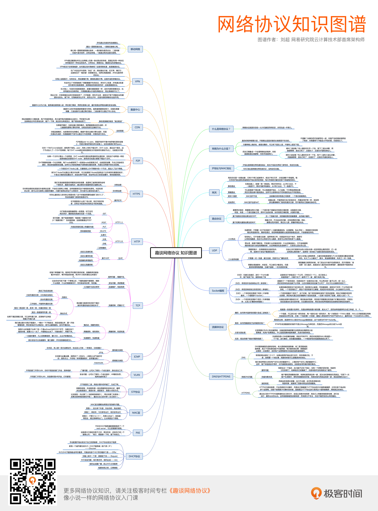

## 计算机网络




### **应用层、表示层、会话层**

####1、Http和Https的区别

Http协议运行在TCP之上，明文传输，客户端与服务器端都无法验证对方的身份；Https是身披SSL(Secure Socket Layer)外壳的Http，运行于SSL上，SSL运行于TCP之上，是添加了加密和认证机制的HTTP。二者之间存在如下不同：

**端口不同**：Http与Http使用不同的连接方式，用的端口也不一样，前者是80，后者是443；

**资源消耗**：和HTTP通信相比，Https通信会由于加减密处理消耗更多的CPU和内存资源；

**开销：**Https通信需要证书，而证书一般需要向认证机构购买； 
　 
Https的加密机制是一种共享密钥加密和公开密钥加密并用的混合加密机制。

---

#### 2、对称加密与非对称加密

　　对称密钥加密是指加密和解密使用同一个密钥的方式，这种方式存在的最大问题就是**密钥发送问题**，即如何安全地将密钥发给对方；而非对称加密是指使用一对非对称密钥，即公钥和私钥，公钥可以随意发布，但私钥只有自己知道。发送密文的一方使用对方的公钥进行加密处理，对方接收到加密信息后，使用自己的私钥进行解密。

由于非对称加密的方式不需要发送用来解密的私钥，所以可以保证安全性；但是和对称加密比起来，它非常的慢，所以我们还是要用对称加密来传送消息，但对称加密所使用的密钥我们可以通过非对称加密的方式发送出去。

---

#### **3. https连接建立过程(面试高频)**

**https访问流程是如何确认安全的：**

1. 访问XXX，客户端（浏览器）连接xxx:443并发送带有Cipher的ClientHellod内容
2. xxx:443收到ClientHellod后与自己支持的SSL/TLS版本协议对比，返回双方都支持的Cipher（接下去就通讯都依靠Cipher规定的算法），同时发送xxx数字证书（包含xxx域名，颁发证书的CA，过期时间，XXX不对称密钥的公钥，经过CA私钥加密证书信息摘要后的【签名】等信息）
3. 客户端验证证书，生成XXX数字证书的信息摘要并和CA不对称密钥的公钥解密签名后的摘要进行比较确认证书有效，并从此确认了xxx提供的xxx不对称密钥的公钥是有效的
4. 至此双方通讯安全可以得到保证，客户端发送内容时带上内容摘要的加密签名，服务端获取内容并生成摘要与解密签名后的摘要进行比较从而确认安全
5. 但不对称算法相当慢所以之后通讯采用对称加密算法，这里就需要先交换一个对称加密的密钥，一般使用Cipher密钥交换协议进行对称密钥交换，客户端生成一个随机值作为对称加密密钥，使用xxx不对称密钥的公钥加密后和对称加密密钥的Cipher算出的MAC值一起发送给xxx:443，xxx:443用不对称密钥的私钥解密后得到对称加密的密钥（会生成对称加密密钥的MAC做验证）
6. 之后通讯都是一方对内容的摘要进行签名，然后另一方解密签名对比摘要

   [SSL/TLS协议和https访问流程](http://forthxu.com/blog/article/63.html) [一篇文章看明白 HTTP，HTTPS，SSL/TSL 之间的关系](https://blog.csdn.net/freekiteyu/article/details/76423436)

##### CA证书

- 作用

  ​	放置客户端A和服务器B的连接，中途被篡改

- 包含了哪些东西？

  ​	证书拥有者的身份信息，CA机构的签名，公钥和私钥

- 具体验证过程

  ​	内置到浏览器的CA根证书解析证书，使用证书中的公钥

简单说：

1. 客户端告诉后端自己支持的加密算法
2. 服务器下发证书，包含域名、颁发证书的CA、过期时间、公钥、CA私钥加密信息摘要后的签名信息
3. 客户端验证证书，查看本地安装的证书的信息摘要和CA公钥解密签名后的摘要进行比较确认证书的有效，和公钥是有效的。


[聊聊 Android HTTPS 的使用姿势](https://dieyidezui.com/talk-about-android-https/)

[数字证书、CA、CA证书，傻傻分不清楚？这一篇看懂！](https://www.jianshu.com/p/950ffeb370db)

---


#### **DNS**(面试高频)

- What?

  Domain Name Server，域名解析服务，就是把域名解析成ip地址。DNS基于UDP服务，端口53。

- 解析过程

  2种模式，根据字段切换。默认使用递归，因为简单，不用多次请求。

  1. 递归解析

     

  2. 迭代解析

     

     |      | 递归                                                         | 迭代                                                         |
     | ---- | ------------------------------------------------------------ | ------------------------------------------------------------ |
     | 内容 | 本机向本地域名服务器发出一次查询请求，就静待最终的结果。如果本地域名服务器无法解析，自己会以DNS客户机的身份向其它域名服务器查询，直到得到最终的IP地址告诉本机 | 本地域名服务器向根域名服务器查询，根域名服务器告诉它下一步到哪里去查询，然后它再去查，每次它都是以客户机的身份去各个服务器查询 |

  

- 缺点

  1. DNS劫持

      - 解决方案 

        ​	HttpDNS

  2. DNS污染

     - 原理

       ​	由于通常的DNS查询没有任何认证机制，而且DNS查询通常基于的UDP是无连接不可靠的协议，因此DNS的查询非常容易被篡改，通过对UDP端口53上的DNS查询进行入侵检测，一经发现与关键词相匹配的请求则立即伪装成目标域名的解析服务器（NS，Name Server）给查询者返回虚假结果。

     - 解决方案

       ​	对于DNS污染，可以说，个人用户很难单单靠设置解决，通常可以使用VPN或者域名远程解析的方法解决，但这大多需要购买付费的VPN或SSH等，也可以通过修改Hosts的方法，手动设置域名正确的IP地址。

  3. 平均访问延迟较高

  4. 用户连接失败率较高

- 参考

  [当浏览器输入网址之后？](https://www.jianshu.com/p/57d4d4a56097)      [例解DNS递归/迭代名称解析原理](https://blog.csdn.net/lycb_gz/article/details/11720247)


**HttpDNS**

- what?

  ​	通过ip直接请求http获取服务器A记录地址，不存在向本地运营商询问domain解析过程，所以从根本避免了劫持问题。

- 优点

  ​	同时由于是ip直接访问省掉了一次domain解析过程，可以在一定程度上降低平均访问延迟。

  


#### **网络拓扑**


#### **Http报文**

``` html
HTTP/1.1 200 OK
Date: Tue, 27 Mar 2018 16:50:26 GMT
Content-Type: text/html;charset=UTF-8
Content-Language: zh-CN

<!DOCTYPE html>
<html>
<head>
<base href="https://pages.kaola.com/" />
<meta charset="utf-8"/> <title> 网易考拉 3 周年主会场 </title>

```


### **传输层(TCP、UDP)**

#### 1.TCP协议如何来保证传输的可靠性

​	TCP提供一种面向连接的、可靠的字节流服务。其中，面向连接意味着两个使用TCP的应用（通常是一个客户和一个服务器）在彼此交换数据之前必须先建立一个TCP连接。在一个TCP连接中，仅有两方进行彼此通信；而字节流服务意味着两个应用程序通过TCP链接交换8bit字节构成的字节流，TCP不在字节流中插入记录标识符。

**对于可靠性，TCP通过以下方式进行保证：**

- **数据包校验**：目的是检测数据在传输过程中的任何变化，若校验出包有错，则丢弃报文段并且不给出响应，这时TCP发送数据端超时后会重发数据；

- **对失序数据包重排序**：既然TCP报文段作为IP数据报来传输，而IP数据报的到达可能会失序，因此TCP报文段的到达也可能会失序。TCP将对失序数据进行重新排序，然后才交给应用层；

- **丢弃重复数据：**对于重复数据，能够丢弃重复数据；

- **应答机制：**当TCP收到发自TCP连接另一端的数据，它将发送一个确认。这个确认不是立即发送，通常将推迟几分之一秒；

- **超时重发：**当TCP发出一个段后，它启动一个定时器，等待目的端确认收到这个报文段。如果不能及时收到一个确认，将重发这个报文段；

- **流量控制：**TCP连接的每一方都有固定大小的缓冲空间。TCP的接收端只允许另一端发送接收端缓冲区所能接纳的数据，这可以防止较快主机致使较慢主机的缓冲区溢出，这就是流量控制。TCP使用的流量控制协议是可变大小的滑动窗口协议。


### 网络层(IP)

#### arp 地址解析协议

- 一问一答：

  ​	ARP协议通过"一问一答"实现交互，但是"问"和"答"都有讲究，"问"是通过广播形式实现(，"答"是通过单播形式。

- 属于哪层？

  ​	基于功能来考虑，ARP是链路层协议；基于分层/包封装来考虑，ARP是网络层协议。（此方法对于ICMP协议同样管用）

- 参考

  [图解ARP协议（一）](https://www.cnblogs.com/csguo/p/7527303.html)  [网络传输中的三张表，MAC地址表、ARP缓存表以及路由表详解](https://www.jianshu.com/p/63fd0faa47da)

  


#### 三张表

**MAC地址表**

​	 在交换机中，存有一张记录局域网主机MAC地址与交换机接口的对应关系的表，交换机就是依据这张表将数据帧转发到指定的目标主机上。


**ARP缓存表**

​	ARP协议是工作在网络层的协议，它负责将IP地址解析为MAC地址。在每台主机中都有一张ARP表，它记录着主机的IP地址和MAC地址的对应关系。


**路由表**


-  选路的原理

  

- 参考

   [网络传输中的三张表，MAC地址表、ARP缓存表以及路由表详解](https://www.jianshu.com/p/63fd0faa47da)


#### 子网掩码

​	子网掩码是一种用来指明一个IP地址所标示的主机处于哪个子网中。子网掩码不能单独存在，它必须结合IP地址一起使用。子网掩码只有一个作用，就是将某个IP地址划分成[网络地址](https://baike.baidu.com/item/网络地址)和[主机地址](https://baike.baidu.com/item/主机地址)两部分

网络地址+主机地址

- 子网掩码的计算?

  ​	欲将B类IP地址168.195.0.0划分成若干子网，每个子网内有[主机](https://baike.baidu.com/item/主机)700台：

  1)700=1010111100，该[二进制](https://baike.baidu.com/item/二进制)为十位数，N = 10

  2)将子网掩码255.255.255.255从后向前的10位全部置0,即为： 11111111.11111111.11111100.00000000，也即255.255.252.0。

  255.255.252.0就是168.195.0.0的700台主机的子网掩码了

- 子网掩码相同，是否就是同一个局域网?

  ​	假设两个IP地址分别是172.20.0.18和172.20.1.16，子网掩码都是255.255.255.0。

  我们可以知道两者的网络标识分别是172.20.0和172.20.1，无法直接通信，也就无法PING通。要想能相互通信，需要将子网掩码改成255.255.0.0。


### 数据链路层(mac)


### 物理层

#### 通信的数据包格式

```
数据包
TCP头 + 数据包
IP头 + TCP头 + 数据包
以太网头 + IP头 + TCP头 + 数据包
```

数据被一层一层封装，其中比较重要的信息是：

- 以太网头中的MAC地址
- IP头中的ip地址
- TCP头中的端口号

有了以上三个信息，数据包就知道从哪来，要到哪去。


### 抓包工具

Wireshark


### 参考:

面试题：

[常见面试题整理--计算机网络篇（每位开发者必备）](<https://zhuanlan.zhihu.com/p/24001696>)

[面试/笔试第一弹 —— 计算机网络面试问题集锦](<https://blog.csdn.net/justloveyou_/article/details/78303617>)


学习资料：

[搞定计算机网络面试，看这篇就够了（补充版）](<https://juejin.im/post/5b7be0b2e51d4538db34a51e>)

[一篇文章看明白 TCP/IP，TCP，UDP，IP，Socket 之间的关系](https://blog.csdn.net/freekiteyu/article/details/72236734)